## RG830 Robot Software Manual

The RG830 project infrastructure is written based on macro logic. Each accessory has its own macro. Macros are shaped according to the surface or channel where accessories will be placed. When we look at the frame from the front, starting from the upper front surface clockwise:

1 (Top Front) - 2 (Right Front) - 3 (Bottom Front) - 4 (Left Front)

5 (Top Channel) - 6 (Right Channel) - 7 (Bottom Channel) - 8 (Left Channel)

The macro for the surface to be assembled is created according to the surface number given above.

**Example:**
- Macro 102 ---> accessory number 1 to surface 2
- Macro 204 ---> accessory number 2 to surface 4
- Macro 2805 ---> accessory number 28 to surface 5

Macros on the robot side are written in the HOME folder and separated according to the profile depth.

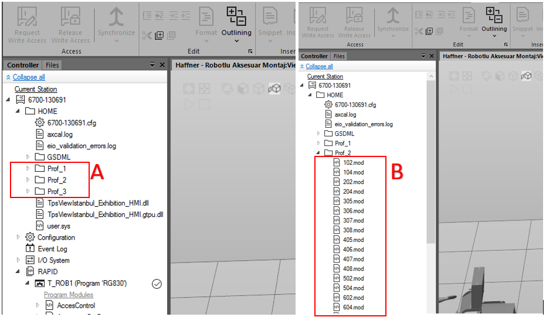

**A:** Number 1 is a 70mm profile, number 2 is a 76mm profile, number 3 is an 88mm profile.

**B:** Shows each accessory’s own macros listed under the profile name.

## Introducing a New Point and Naming It

- METHOD 1

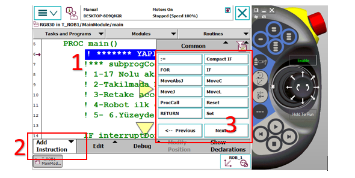

**1:** Touch the line you want to define on the pendant to select that line.

**2:** Opens the command names.

**3:** The commands we want to add are listed here. When you press MoveL from the motion commands, it asks whether to insert above or below the selected point.

When the MoveL command is added from the FlexPendant, a '*' appears in the coordinates on that line. At this stage, the robot assigns coordinates based on the currently selected Tool and Wobj data when recording the position. To prevent incorrect definitions, make sure the Tool and Wobj selections are correct before adding the command.

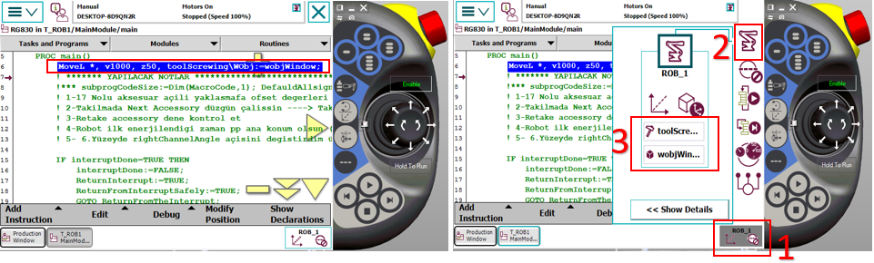

**1:** Opens the list.

**2:** Opens the robot movement, tool, and wobj options.

**3:** The section where Tool and Wobj are selected.

After these steps, to use this command elsewhere, we need to name the '*' entry. Therefore, we need to define a variable as a "robtarget" and assign the coordinates in the starred area to that variable by giving it a name. This operation can be done through Robot Studio.

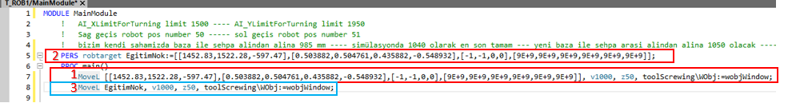

**1:** The line shown on the FlexPendant as it appears in Robot Studio.

**2:** The variable definition section where the name assignment is made for the starred part shown on the FlexPendant (for example, EgitimNok).

**3:** The use of the variable name assigned to the starred area on the FlexPendant.

After naming it as shown in number 3, since it is the same as number 3, we can delete number 1 from the program to avoid confusion.

Now the variable EgitimNok can be called and used by name within the program.

- METHOD 2

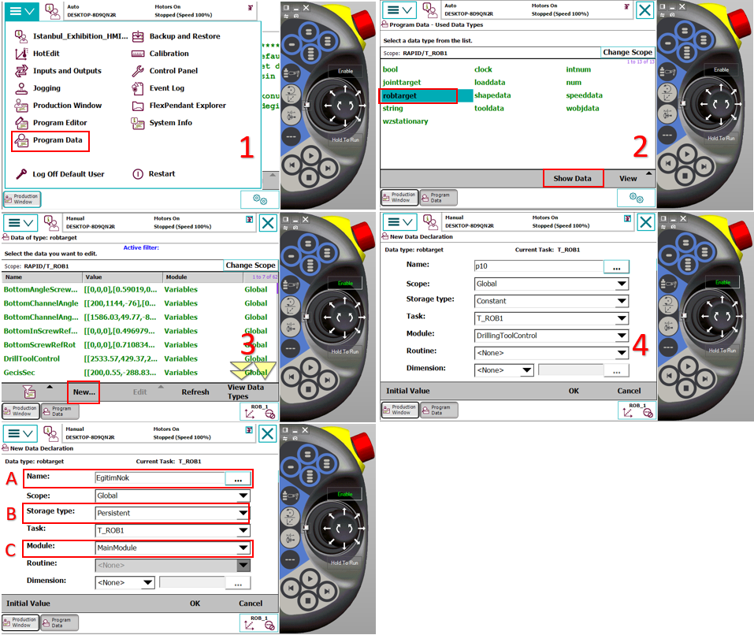

**A:** The name assigned to the point to be defined.

**B:** Selection of the storage type.

**C:** Select which module the variable will be saved to.

After pressing OK, it saves the position definition into the chosen module based on the previously selected tool and wobj. This variable can be used in the same format shown in the red frame 3 of METHOD 1.

## Applying Offset, Speed, and Zone to a Point

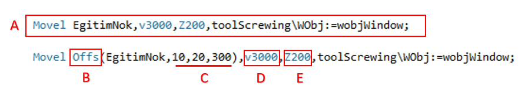

**A:** The simplest form of the defined point. When modifying a point, this simplest form is used. Offset notation is not allowed.

**B:** A function used to shift the robot by certain distances relative to a base reference point (EgitimNok). Instead of teaching a new point, it generates movement by deviating from an existing point.

**C:** X, Y, Z offset values in mm.

**D:** Determines how many millimeters per second the robot's end effector (TCP) moves.

**E:** The corner (path) parameter that determines how close the robot will approach the target point or how smoothly it will pass the point.

## Adding a New Path to Magazines

Accessory pickup and dropoff coordinates in the system are stored in an Array architecture structured by floor and accessory number. When a new accessory is added to the system, sequential insertion into these arrays is required to preserve the existing hierarchy.

- New Position Addition Procedure:

**Variable Definition:** Go to the existing accessory array in the Variables module of the program.

**Array Expansion:** Add the new coordinate data to the array while following the existing floor and accessory order.

**Teach the Point:** The robot’s physical position for the new index added to the array must be taught and the robtarget data updated.

You can see the arrays in Variables in the image below.

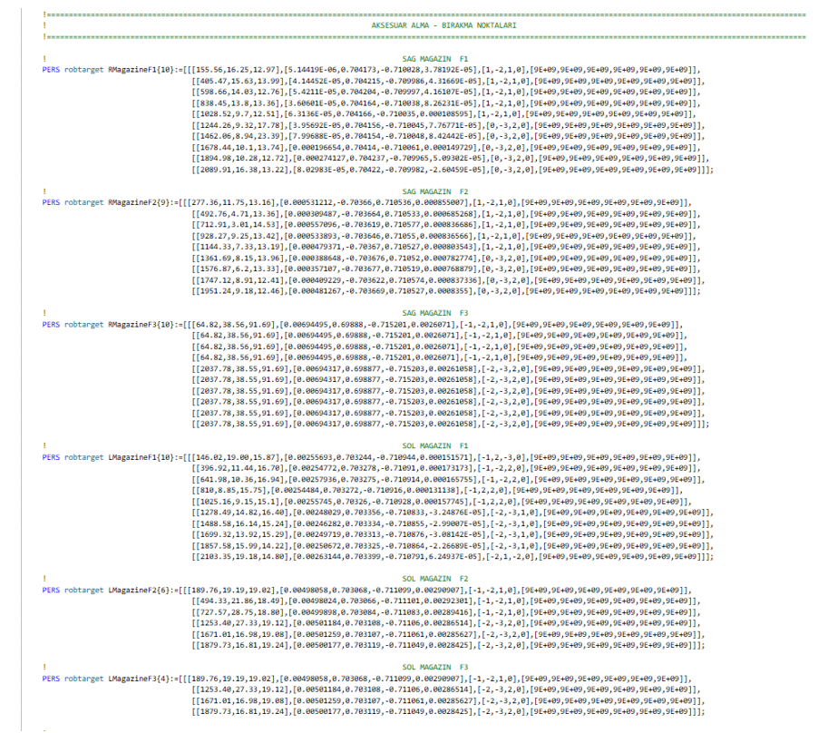

- While teaching the newly added path, follow the order shown in the image below. After selecting the accessory you added, press modify to update the point. During this process, the tool selection should be ToolGrip and the Wobj should be selected according to the magazine being taught.

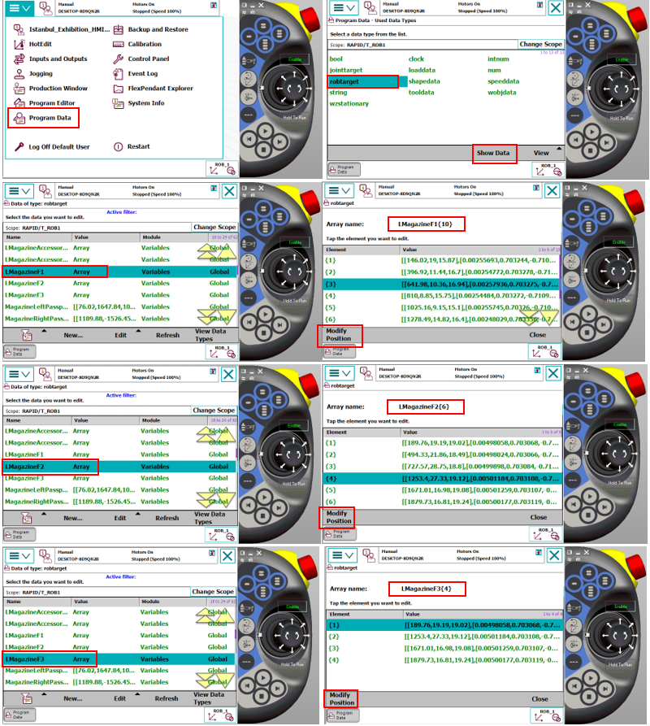

Each accessory in the system has its own control sensor for presence/absence checking. The following procedure should be followed to correctly define the accessory control point:

- Alignment and Positioning:

After the robot picks the mold from the relevant station, it should exit in a straight path without disturbing the grip plane and orientation. The accessory should be positioned directly in front of the sensor and within its detection range. The robot position at this control point should be determined and recorded as the position where the sensor sees the accessory most stably.

- Software Structure:

Like pickup and dropoff points, accessory control points are also defined in Array structures named specifically for each accessory group. Sequential addition should be done for the new path. This allows separate and independent control coordinates for each accessory type. Entries should be added to the LMagazineAccessoryControl and RMagazineAccessoryControl sections in the Variables module of the program. Below you can see the Arrays for Accessory Control.

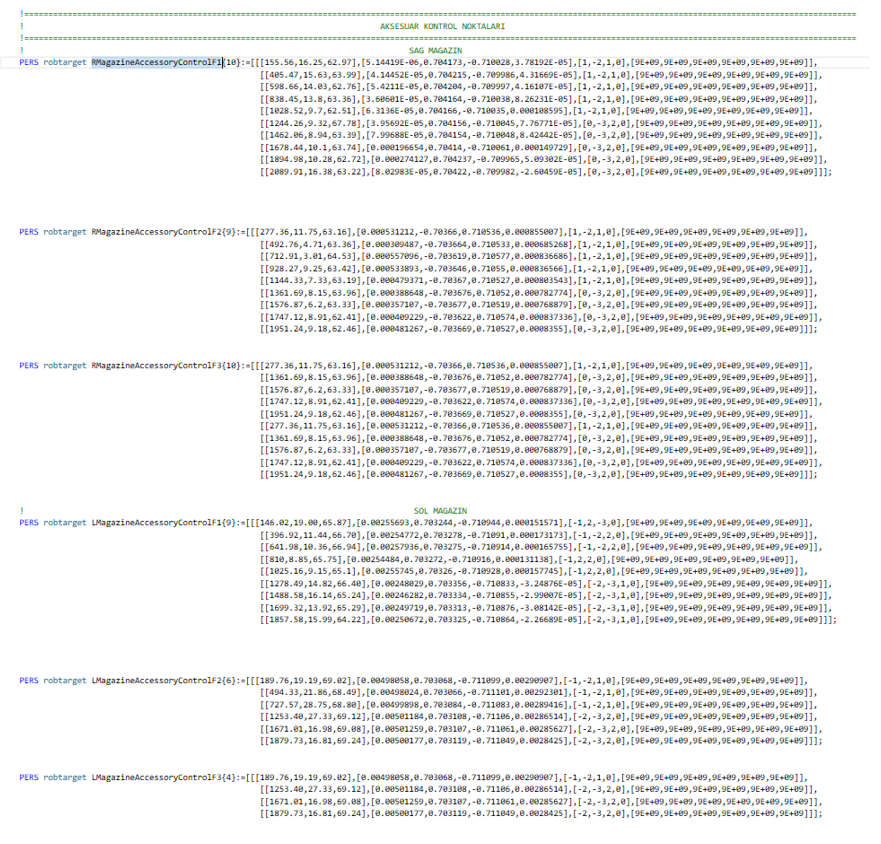

- Recording Process:
After precise positioning is completed, the point registration steps should be carried out by following the visual instructions below.

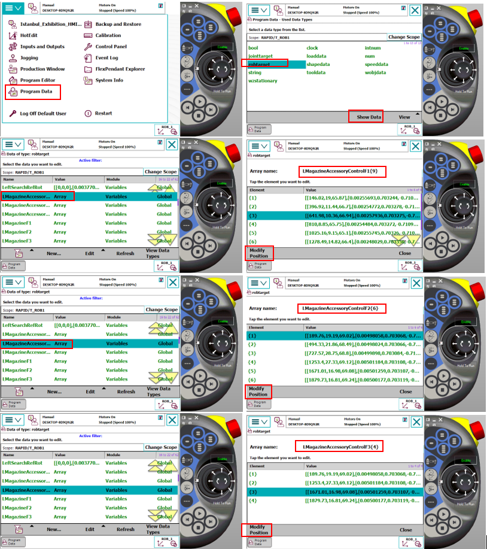  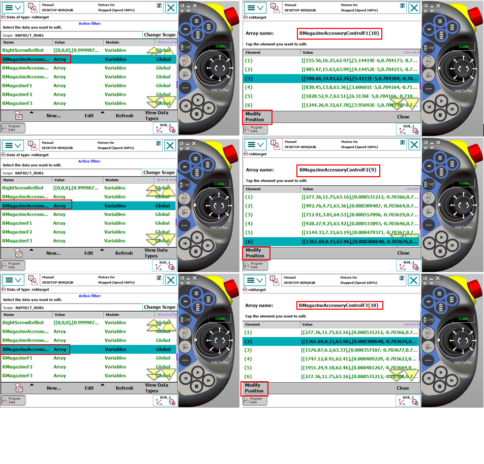

