## 1. RG830 Robot Software Manual

The RG830 project framework is implemented using a macro-based structure. Each accessory has its own macros. Macros are shaped depending on whether accessories mount to a surface or into a channel. When viewing the frame from the front top surface clockwise, the surfaces are named as follows:

1 (Top Front) - 2 (Right Front) - 3 (Bottom Front) - 4 (Left Front)

5 (Top Channel) - 6 (Right Channel) - 7 (Bottom Channel) - 8 (Left Channel)

The macro for the surface to be assembled is created according to the surface number given above.

**Example:**
- Macro 102 ---> accessory number 1 to surface 2
- Macro 204 ---> accessory number 2 to surface 4
- Macro 2805 ---> accessory number 28 to surface 5

Macros on the robot side are written and organized in the HOME folder according to the profile depth.

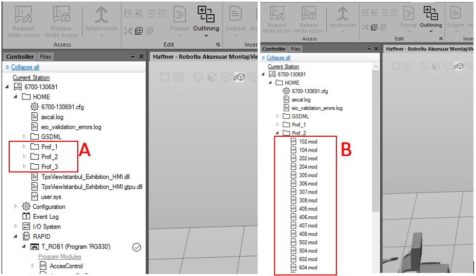

**A:** Number 1 is a 70 mm profile, number 2 is a 76 mm profile, number 3 is an 88 mm profile

**B:** Under the profile name, it shows each accessory's respective macros.

## 2. Teaching a New Point and Naming

- METHOD 1

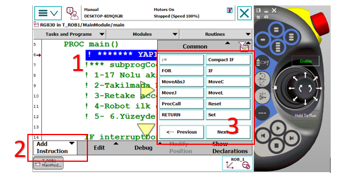

**1:** Touch the line on the pendant that you want to teach to mark that line.

**2:** Opens the command names.

**3:** Commands you want to add are listed here. When adding a motion command and pressing MoveL, it will ask whether to insert above or below the marked point.

When a MoveL command is added from the FlexPendant, a '*' (star) symbol will appear at the coordinates on that line. At this stage, when recording the position, the robot assigns coordinates by referencing the currently selected Tool and Wobj (work object). To prevent incorrect definitions, make sure the Tool and Wobj selections to be used are correct before adding the command.

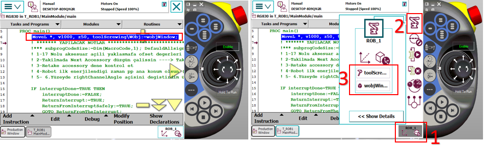

**1:** Opens the list

**2:** Opens movement, tool, and wobj options related to the robot

**3:** The section where we select Tool and Wobj

After these operations, to use this command elsewhere, the '*' entry must be given a name. Therefore, define a variable as a `robtarget` and assign the coordinate information in the starred area to that variable by naming it. This operation can be performed in RobotStudio.

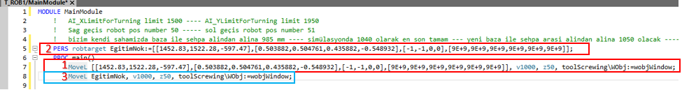

**1:** How the line seen on the FlexPendant appears on the RobotStudio screen

**2:** The variable-definition area where the named assignment to the starred part on the FlexPendant (for example `EgitimNok`) is made

**3:** Using the variable name assigned to the starred area shown on the FlexPendant

After naming as in item 3, if it duplicates an existing entry shown in item 1, you can remove the redundant item from the program to avoid confusion.

Now the variable `EgitimNok` can be called and used by name inside the program.

- METHOD 2

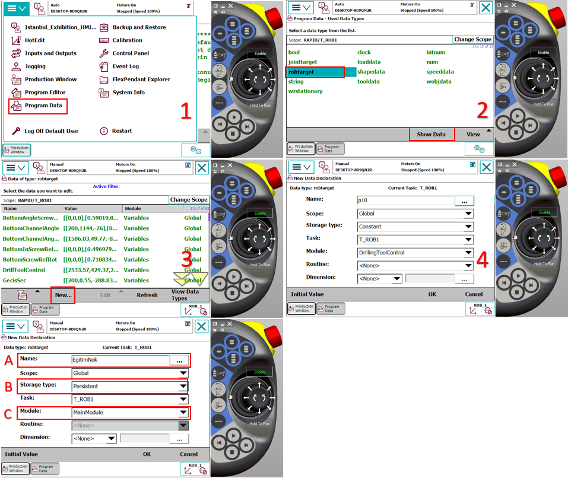

**A:** Name given to the point to be taught

**B:** Selection of storage type

**C:** Choose which module to save the variable into

After pressing OK, the chosen module will store the position definition according to the previously selected Tool and Wobj. This variable can be used in the same way as shown in the red-framed example in METHOD 1.

## 3. Offsetting, Speed and Zone Settings from a Point

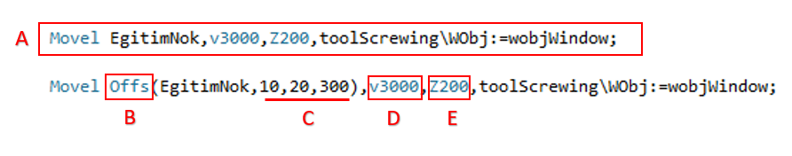

**A:** The simplest form of the defined point. When modifying a point, this minimal form is used. Offset-style entries are not allowed during Modify.

**B:** A function used to offset the robot by certain distances relative to a base reference point (e.g., `EgitimNok`). Instead of teaching a new point, it produces motion by deviating from an existing point.

**C:** X, Y, Z offset values in millimeters

**D:** Determines how many millimeters per second the robot's end-effector (TCP) will move.

**E:** The corner (path) parameter that defines how close the robot will approach the target point or how "softly" it will pass the point.

## 4. Adding New Paths to Magazines and Introducing the Control Sensor

The pick-and-place coordinates for accessories in the system are stored in array structures organized by floor and accessory numbers. When a new accessory is added to the system, it is necessary to add entries to these arrays sequentially to preserve the existing hierarchy.

- New Position Addition Procedure:

**Variable Definition:** Navigate to the existing accessory array in the program's Variables module.

**Array Expansion:** Include the new coordinate data into the array following the existing floor and accessory order.

**Teach Point:** Teach the robot's physical position for the newly added index and update the `robtarget` data.

You can see the arrays in Variables in the image below.

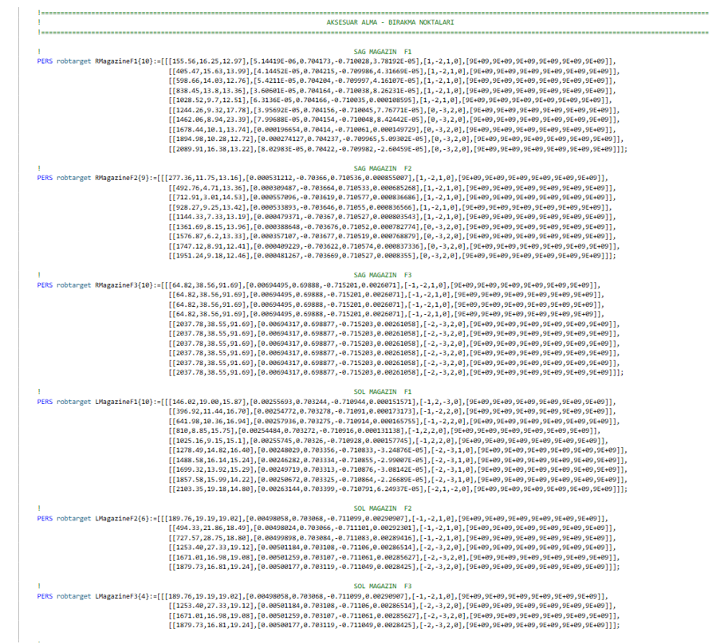

- When teaching the newly added path, follow the order shown in the figure below. After selecting the accessory you added, press Modify to update the point. During this operation, ensure the Tool selection is `ToolGrip` and the Wobj is selected according to the magazine being taught.

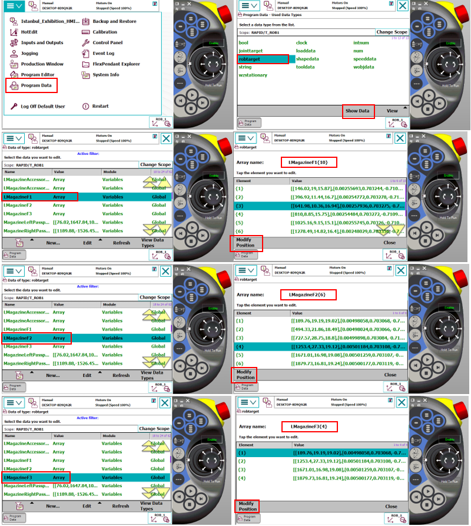

Each accessory in the system has its own presence/absence control sensor. To correctly define the accessory control point, follow this procedure:

- Alignment and Positioning:

After the robot picks the part from the relevant station, it should exit along a linear path without disturbing the gripping plane and orientation. The accessory must be positioned directly in front of the sensor and within detection range. The robot position at this control point should be determined and recorded as the position where the sensor detects the accessory most stably.

- Software Structure:

Like pick-and-place points, accessory control points are defined inside array structures named specifically for each accessory group. Additions must be made sequentially for the new path. This creates separate and independent control coordinates for each accessory type. Add entries to the `LMagazineAccessoryControl` and `RMagazineAccessoryControl` sections in the Variables module of the program. Below you can see arrays for Accessory Control.

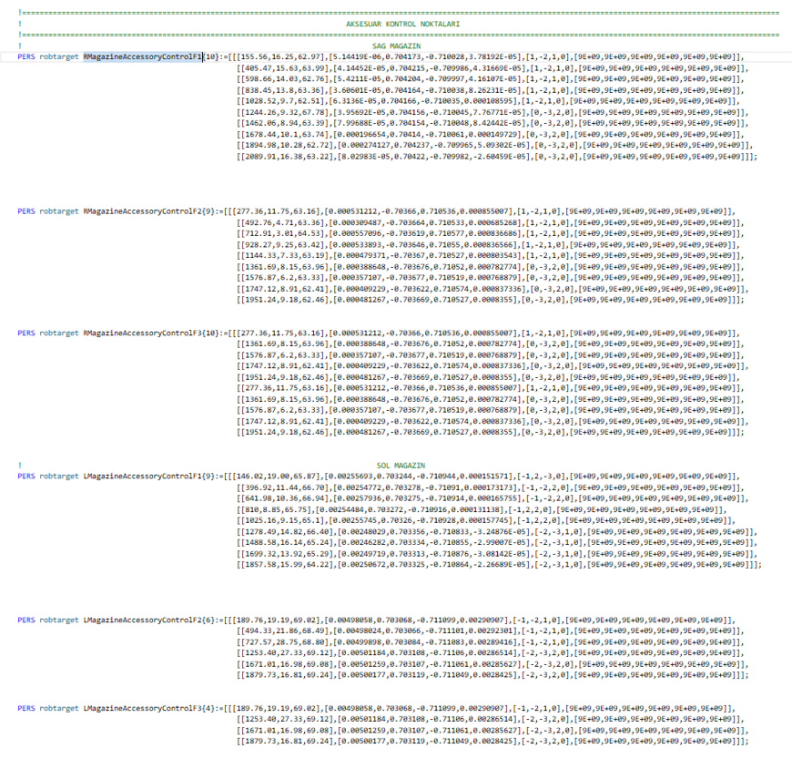

- Registration Process:
After precise positioning, perform the point registration steps by following the visual instructions. The images below show example representations for each of the three levels of the left and right magazines (F1, F2, F3).

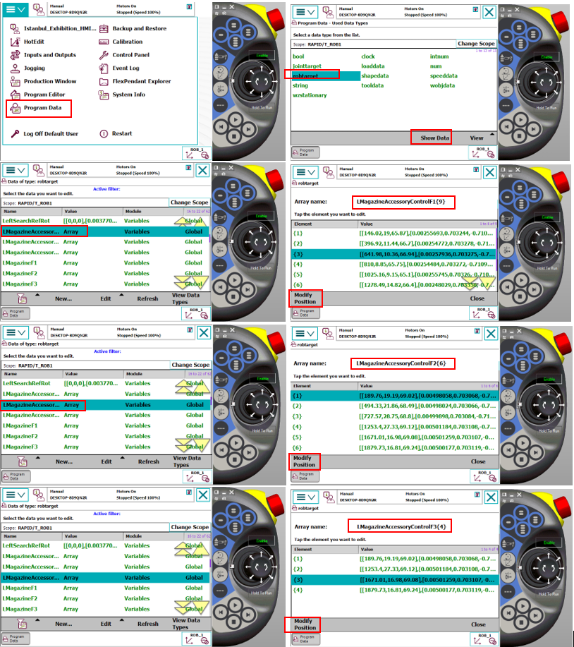  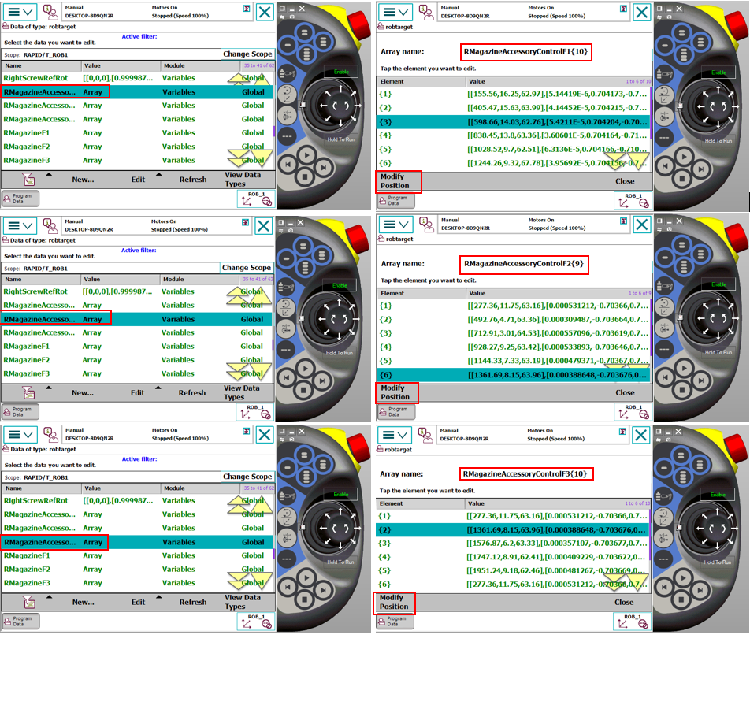

## 5. Providing an Offset for Angular Approach When Placing Accessories into Channels

In robot macros, before the pins of accessories mounted into channels fully seat into their positions, we first approach at an angle with a certain offset value and then move to the actual position. The name of this angular approach depends on the target surface:

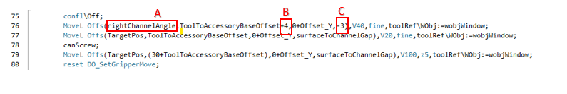

- It is defined as `TopChannelAngle`, `RightChannelAngle`, `BottomChannelAngle`, `LeftChannelAngle`. This operation is placed before the macro's first screwing operation `*canScrew;*`.

*A:* Name of the surface being approached at an angle
*B:* X offset given for positioning the angled approach. This varies depending on the surface orientation.
*C:* Z offset given for positioning the angled approach. This varies depending on the surface orientation.

!!! These offsets vary in x, y, z coordinates depending on the surface orientation. On surfaces 5 and 7, the y value receives "+/-" offsets; on surfaces 6 and 8, the x value receives "+/-" offsets. The z value is the same for all, and the approach direction is adjusted through testing.