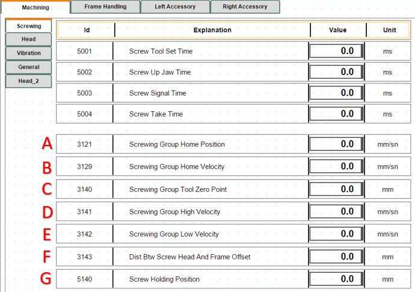

## 1. Makine İlk Açılışta Robot Gripper Kalıp Durumu

- Sistem ilk açıldığında resetleme sonrası gripperda kalıp olup olmadığının teyitini ister.

*YES:* Elinde olan kalıbı kendi numarasındaki yere bırakarak tekrar home pozisyonuna döner ve iş dosyası ile haberleşmeyi bekler.

*NO:*  Home pozisyonunda iş dosyası ile haberleşmeyi bekler.

**NOT:** İş dosyası manuel olarak eklenirse aşağıdaki üç maddelik anlatım ile yapılacaktır. Otomatik sistem çalışırken kendisi sistemden çekeceğinden bu işlemleri yapmaya gerek kalmayacak.

- İş dosyasının okunabilmesi için exe dosyası açılmalıdır.
- Hazırlanan iş Dosyası Robot File klasörünün içine konulmalıdır.
- Start butonuna basıldığında Robot File klasöründeki iş dosyası okunarak Plc den robota veri aktarımı gerçekleşir bilgi aktarımı tamamlandıktan sonra Robot iş dosyasını çalışmaya başlar.

## 2. Robot Bypass ve Hattın Bağımsız Çalışma Modu

Robotun operasyona dahil edilmeyeceği durumlarda, hattın kesintisiz çalışmaya devam edebilmesi için aşağıdaki yapılandırma uygulanmalıdır:

*Parametre Ayarı:* Robot kontrol ekranı üzerinden "RobotActive" parametresi "0" olarak ayarlanmalıdır. Bu ayar yapıldığında robot operasyonu otomatik olarak Bypass edilir. Robot devre dışı kalarak hattın tek başına çalışmasına olanak tanır.

*İş Akışı (Çerçeve Transferi):* işlenen çerçeveler doğrudan hat üzerinden ilerleyerek robot çıkışında bulunan aktarma sehpasına yönlendirilir.

## 3. Kapıların açılma İzin Prosedürü

Operatör tarafından **"Kapı Açma İzin Butonu"**na basıldığında; robot, mekanik güvenliği ve parça bütünlüğünü korumak adına aktif işlemini tamamladıktan sonra duruşa geçer.

*İşlem Tamamlama Senaryoları:*

Sistem aşağıdaki işlemlerden biri yürüyor ise süreci kesmez, işlemin bitmesini bekler:

- Vidalama: Aktif vidalama işlemi tork değerine ulaşana kadar devam eder.

- Vida Besleme: Vida çekme veya transfer işlemi tamamlanır.

- Delme: Delme ucu iş parçasından güvenli şekilde geri çekilir.

- ..........

- ...........

Aktif döngü (cycle) güvenli noktada tamamlandığında, sistem otomatik olarak kapı kilitlerini açar ve operatöre giriş onayı verir.

## 4. Acil Stop - Stop senaryoları

*Acil Stop Durumu:*

Acil Stop butonuna basılması durumunda güvenlik protokolü gereği aktif iş çevrimi (cycle) iptal edilir ve sistem güvenli duruş moduna geçer. Bu işlemden sonra sistem verileri sıfırlandığı için iş dosyasının en baştan başlatılması zorunludur.

*Sistemi Tekrar Aktif Hale Getirme Adımları:*

- Basılı olan Acil Stop butonu serbest bırakılır.
- *A:* Operatör panelinden Alarmlar (Reset) temizlenir.
- *B:* Reset e basılır . Robot Po to Main yapar arkasından **C** soru paneli açılır
- *C:* Gripper üzerinde kalıp var,yok sorgusu yapılır. Daha sonrasında **D** soru paneli açılır
- *D:* Acilden sonra aynı iş dosyası ile mi yoksa farklı bir iş dosyası ile mi çalışacağına dair soru paneli açılır.

  *YES:* Hafızadaki iş dosyası ile devam eder.

  *NO:*  Farklı iş dosyasının yüklenmesini bekler. Belli bir süre iş dosyasını okuyamazsa, dosya okuyamadığına dair hata mesajı verir.

  *Stop Durumu:*

Sistemde *E (Stop Butonu)*'na basıldığında, PLC ve robot koordineli bir "bekleme moduna" geçer. Bu sürecin teknik işleyişi şu şekildedir:

 - *PLC*, stop sinyali alındığında, mevcut çalışma adımını (state) dondurarak sistemi "Stop State" moduna alır.

 - *Robot*, Stop sinyali geldiği anda Robot Vidalama işlemi , Vida besleme işlemi , delme işlemi yapmıyorsa Plc den gelen sinyal ile hızını sıfıra çeker ve hareket edeceği satırda bekler

 - *Sistemi Yeniden Başlatma :* Operatör tarafından **F (Start Butonu)**'na basıldığında, PLC ilgili durum bitini aktif ederek sistemi kaldığı adım üzerinden tekrar normal çalışma döngüsüne yönlendirir.

## 5. Hat ile Çalışacağı Zaman, Hattan Çerçeve Ne Zaman Gelecek, Hattaki Çerçeve ile Gelen Çerçeve Aynı mı?

Hattın senkronize çalışabilmesi için çerçeve transferi ve iş dosyası oluşturma süreci şu kriterlere göre ilerler:

*Çerçeve Geliş Koşulu:* Hat sonundaki çıkış sehpasında (Z) hazır bir çerçeve bulunması durumunda robot plc sinden yeni çerçeve isteğini bekler.

*İş Dosyası Oluşturma:* Robotun işlemine başlayabilmesi için (Z) sehpasındaki çerçevenin iş dosyasının oluşturulmuş ve sisteme tanımlanmış olması gerekir.

*Hattaki çerçeve ile gelen çerçeve Kontrolü:* (Z) sehpasındaki mevcut çerçeve ile plc yazılımından gelen iş dosyasındaki çerçeve ID leri birbiriyle eşleşmelidir. Eşleşme varsa robot işlemi başlatır, Eşleşme yoksa yanlış iş dosyası alarmı verir

## 6. Çerçeve Sıkıştırmada Alarm Durumları

Sistem hazır olduğunda çerçeve çıkış sensörüne geldiğinde çerçeveyi sıkıştırmak için Eksen yaklaştığında yeteri kadar sıkamadığında ölçüm ile ilgili olarak **"Frame Measuring Error, Wrong Frame Sizes !"** hatası verir tekrar sıkması için **(F) Start Buton**'una basıp tekrar sıkıştırma işlemi yapılır.

## 7. Drilling Tool Not Ok Alarm Durumu

*Sistem, operasyon güvenliğini sağlamak adına her iş başlangıcında bir kez olmak üzere otomatik takım kontrolü gerçekleştirir. Sürecin işleyişi ve hata durumunda yapılması gerekenler aşağıda belirtilmiştir:*

- Robot, delme takımının (tool) fiziksel bütünlüğünü doğrulamak amacıyla takım ucunu önceden tanımlanmış bir kontrol siviçine (switch) temas ettirir.

- Tool ucu sensöre temas edip sinyal aldıktan sonra işlem akışı devam eder.

- Takım kontrol noktasına ulaştığı halde siviçten doğrulama sinyali alınamazsa, robot otomatik olarak hareketi durdurur. Güvenli bir bekleme pozisyonuna (kontrol noktasının üst kısmı) geçerek operatör panelinde durum alarmını aktif hale getirir.

*Müdahale ve Arıza Giderme:*

- *Takım Hasarı:* Eğer delme ucu fiziksel olarak zarar görmüş veya kırılmışsa, yeni bir takım ucu ile değiştirilmelidir.

- *Sensör Kontrolü:* Takım ucunda bir sorun gözlemlenmiyorsa, ilgili kontrol sensörünün (switch) işlevselliği ve kablo bağlantıları kontrol edilmelidir.

- *Sistemi Tekrar Devreye Alma:* Gerekli fiziksel düzeltmeler yapıldıktan ve arıza kaynağı giderildikten sonra, operatör paneli üzerinden **Start Butonuna (F)** basılarak işlem döngüsü kaldığı yerden devam ettirilir.

## 8. Accessory Not Ok Alarm Durumu

Aksesuar montaj sürecinin sağlıklı ilerleyebilmesi için parçanın magazinden başarıyla alınması ve kalıp içerisinde hassas şekilde konumlanması kritik önem taşımaktadır. Bu doğrultuda, montaj aşamasına geçilmeden önce parçanın varlığı ve konumu sensörler aracılığıyla denetlenir.

Robot tarafından kontrol noktasına getirilen aksesuarın sensör tarafından algılanmaması durumunda sistem "AccessoryNotOk" alarmı üretir; robot, operatör müdahalesine imkan tanımak için kontrol noktasından bir miktar yükselerek bekleme moduna geçer. Bu durumda izlenmesi gereken çözüm yolları aşağıda belirtilmiştir:

*Manuel Müdahale ile Devam Etme*

- Eğer aksesuar magazinden çıkmış fakat kalıp tarafından tam alınamadığı için magazin üzerinde kalmışsa:

Operatör, emniyet kapısını açarak (sistem Acil Stop moduna geçecektir) hattın içerisine girer. Magazindeki aksesuarı alarak, geliş yönüne dikkat ederek el ile manuel olarak kalıba yerleştirir.Hattan çıkıp emniyet kapısını kapattıktan sonra sistemi resetleyip panel üzerinden **F (Start Buton)**'una basarak süreci kaldığı yerden devam ettirir.

*Alma İşleminin Tekrarlanması (Aksesuar Magazindeyse)*

- Eğer aksesuar magazinde kalmışsa ve operatör bu parçanın robot tarafından tekrar alınmasını istiyorsa:

Hattan çıktıktan ve emniyet kilidini devreye aldıktan sonra panel üzerindeki **B (Reset Butonu)**'na basılır. Bu işlemle birlikte robot, aynı aksesuarı alma döngüsünü en baştan tekrarlayacaktır.

*Magazinden Aksesuar Çıkmaması Durumu*

- Eğer magazinden hiç aksesuar çıkmadığı için robot boş dönmüş ve bekleme noktasına gelmişse:

Hata giderildikten sonra panel üzerinden **B (Reset Butonu)***'na basılarak aksesuar alma işlemi yeniden başlatılır.

## 9. Çeneye Vida Çekilememe Durumu

Robot, vidalama işlemi öncesinde sistemden vida besleme talebinde bulunur. Vida beslemesinin başarısız olması durumunda operatör aşağıdaki adımları izlemelidir:

*Ön Kontrol:*

- Operatör, öncelikle vidalama ucunu gözle kontrol ederek vidanın gönderilip gönderilmediğini teyit etmelidir.

*Vida Gönderimi Başarılı İse (Görsel Onay):*

- Eğer vida uca ulaşmışsa ve herhangi bir sorun gözlemlenmiyorsa:

Hattın içerisine girildiği için öncelikle sistem emniyet devreleri resetlenmelidir.Ardından panel üzerindeki **F (Start Butonu)**'na basılarak işlem kaldığı yerden devam ettirilmelidir.

*Vida Beslenemedi İse (Hata Onayı):*

- Eğer görsel kontrolde vidanın uca ulaşmadığı teyit edilirse:

Hattın içerisine girildiği için öncelikle sistem emniyet devreleri resetlenmelidir. Ardından panel üzerindeki **B (Reset Butonu)**'na basılarak vida çekme işlemi yeniden tetiklenmelidir.

## 10. Aktüel Aksesuar Montajını Geçmek için PassNextAccessory

Robotun delme, vidalama veya diğer operasyonları sırasında herhangi bir sorunla karşılaşılması durumunda, mevcut iş akışını bozmadan sürece müdahale etmek için aşağıdaki adımlar izlenmelidir:

*İşlemin Durdurulması:*
- Panel üzerinden E (Stop Butonu)'na basılmalıdır. Bu işlem robotu bekleme moduna alır.

*Dikkat:* Bu aşamada B (Reset Butonu)'na basılırsa, tüm işlem durumu (state) sıfırlanır ve süreç en başa döner.

## 11. İşlemin Yeniden Başlatılması ve Seçenekler

- Durdurma işleminden sonra F (Start Butonu)'na basıldığında, ekranda bir karar sayfası açılır. Operatör bu aşamada şu iki seçenekten birini tercih etmelidir:

*G:* Robotun, kaldığı yerden işlemlerine devam etmesini sağlar.

*H:* Robotun, mevcut işlemini iptal ederek bir sonraki aksesuar döngüsüne geçmesini sağlar.

*Kritik Uyarı:* **H** seçeneği tercih edildiğinde robot kendisini güvenli bir şekilde kurtardıktan sonra Gripper da kalıp varsa bırakma noktasına gidecektir. Bırakma işlemi sırasında kalıpta aksesuar bulunmadığından emin olunmalıdır.

## 12. Aksesuar Montaj Alarm Tanımları ve Çözüm Adımları

Aşağıda belirtilen alarmlar montaj esnasında meydana gelebilecek alarm mesajlarıdır.

**Screw Drop failed !** 9.madde bu alarm durumunu özetler.
**Screw did not move to jaw or Screw detector broken !** "Vida Besleme Bekleme Zaman Aşımı" hatasıdır. Sistem vida besleme modundayken belirli bir süre geçmesine rağmen vidanın hedefe ulaştığına dair sinyal Vida kontrol sensöründen alınamadığında tetiklenir. Bu hataya sebep olabilecek hatalar aşağıdaki gibi olabilir: 

- **Besleme Haznesi Boş:** Vida dizici vibratörde veya besleme ünitesinde vida kalmamış olabilir.

- **Mekanik Sıkışma:** Vida, besleme hortumu içinde veya ağız kısmında sıkışmış, sensöre ulaşamamış olabilir.

- **Hava Basıncı Sorunu:** Vidayı itmek için kullanılan hava basıncı yetersizdir.

- **Sensör Arızası:** ScrewCame sensörü vidayı görmüyor veya fiziksel olarak yerinden oynamış olabilir.

## 13. Eksen Hareket halindeyken Sıkışması Durumu

Robot bazen fiziksel bir engele çarpmadığı halde, gitmek istediği noktaya matematiksel olarak ulaşamaz veya eklem limitlerine takılır. Bu durumlarda operatörün kurtarması için izleyeceği adımlar şunlardır:

## 13.1. Sorunu Teşhis Etme (Hata Mesajı Okuma)

- Ekranda aşağıdaki mesajlardan birini görüyorsanız robot "geometrik" bir çıkmaza girmiştir:

*"Axis Limit":* *Robot bir ekleminin dönebileceği son noktaya gelmiştir.

*"Singularity"* (Tekillik): Robotun bilek eksenleri (4 ve 6) aynı hizaya gelmiş, robot yönünü şaşırmıştır.

*"Out of Reach":* Robotun kolu o noktaya yetişemiyor veya o rotayı takip edemiyordur.

## 13.2. Robotu Manuel Modda Kurtarma (Jogging)

Kontrol ünitesinden anahtarı saga çevirerek **B (Manuel Mod)**'a alın

- Robot bu hataları verdiğinde genellikle "Linear" (Doğrusal) modda hareket etmeyi reddeder. Robotu rahatlatmak için:

*Hareket Modunu Değiştirin:* FlexPendant üzerinden hareket modunu "Axis" (Eksen) moduna getirin. **A** tuşuna basıldığında **B** kısmının 1-3 ve 4-6 arasında eksen olarak değiştiğini göreceksiniz. 

*Eksenleri Manuel Döndürün:* Limit hatası varsa: Sınıra dayanan ekseni ters yöne doğru joystick ile çevirin.Hangi eksen arasında çalışılacaksa o alanda **B** kalınmalı ve Jogging sayfasındaki joystick yönlerinin nasıl çalıştığını gösteren görsele bakarak hareket ettirilmelidir.

*Tekillik (Singularity) varsa:* 5. ekseni (bilek bükme) hafifçe yukarı veya aşağı hareket ettirerek eksenlerin aynı hizadan çıkmasını sağlayın.

*Güvenli Bir Noktaya Çekin:* Robotu, sorun yaşadığı noktadan yaklaşık 5-10 cm uzaklaştırıp boşluğa (güvenli alana) alın.

## 13.3. İşlemi "Atlatma" ve Devam Ettirme (Program Pointer Taşıma)

- Operatörün asıl yapması gereken, robotu o "hatalı noktadan" kurtarıp bir sonraki güvenli işlem adımına manuel olarak yönlendirmektir.şu adımları izleyin:

*Program Editor Sayfasını Açın:* FlexPendant'ta  kısmına girin **A**'dan menü çubuğuna ve **B**'ye basarak Program Editör sayfasını açın.

*Bir Sonraki Adımı Seçin:* Kod içerisinde robotun takıldığı satırın bir altındaki veya bir sonraki işlem başlangıcı olan (Örn: MoveL veya MoveJ) satıra dokunarak seçili hale getirin. Görsel **C**. Arada komut satırları varsa komut satırlarını atlamayın. Plc tarafında state lerde takılma yaşamamak için. 

*İmleci Taşıyın (PP to Cursor):* **D** "Debug" menüsünden **E** "PP to Cursor" (Program İmlecini Seçili Satıra Taşı) seçeneğine basın.

Bu işlemlerden sonra önce manuel olarak çalıiştırılarak işlemin devam edilebilir olduğu izlemek sağlıklı olacaktır. Manuel olarak adım adım ilerlemek için Flexpendant üzerinden görseldeki **F** Motor On butonunu **basılı tutun** Görsel **H** da olduğu gibi siz basılı tutarken Motor On yazısının olduğunu görün manuel de işlemleri bu şekilde ilerletebilirsiniz. Sonrasında Görsel **G** adım adım her satırı işletmek için kullanılır her basışta kendi içinde bir satır okuyarak ilerler. Görsel **G** de adım adım gitmek istemiyorsanız Görsel **I** ya bastığınız da tüm satırları adım adım taramaya başlar. Robot çalışırken durdurmak istediğiniz zaman Görsel **J** Stop butonu na basabilir yada Görsel **F** Motor On butonundan elinizi çekebilirsiniz. Robotu çalıştırdıktan sonra robot sonraki adıma kendisi gidebildiyse bu aşamadan sonra Robotu Otomatik Moda alarak tekrar çalıştırabilirsiniz.

*Otomatik Mod ve Start:* Görseldeki **K** yönüne anahtarı çevirin Flexpendant ekranına gelen soruları onaylayın ve Sistemi "Auto" moduna alın, görseldeki **L** kısmına basarak motorları aktif hale getirin ve sistemdeki alarmları kaldırdıktan sonra Start vererek işlemlerinize devam edin

*Hız Kontrolü:* Robot ilk hareketini yaparken hızı %10-%25 seviyesinde tutarak yörüngesini izleyin. bir sorun gözlemlenmez ise hızı tekrar %100 e alabilirsiniz. Hız ayar sayfası için sırasıyla görseldeki **M-N** kısımlarına tıklayarak **O** hız sayfasını açabilirsiniz.

## 14. Ekrandaki Parametreler hakkında , vidalama eksen hızları hakkında detaylı bilgi

**A:** Vidalama eksen grubunun Home pozisyonunu **(Parametre Değer:53)** belirler.

Sistem aşağıdaki durumlarda otomatik olarak ekseni bu pozisyona getirir:

Çevrim Sonu: Bir vida çakma işlemi başarıyla tamamlandığında, yeni bir vida almak veya parçanın geçişine izin vermek için.

Reset İşlemi: Makine sıfırlandığında (Reset) veya başlangıç konumuna döndüğünde.

Vida Boşaltma (Unload): Sistemdeki mevcut vidanın tahliyesi sonrası güvenli bekleme noktasına geçişte.

**B:** Vidalama eksen grubunun işlem bittikten sonra veya Reset durumunda Home a geri dönerken kullandığı hızdır. **(Parametre Değer:50)**

**C:** Bu parametre, vidalama ucunun referans alınan fiziksel sıfır noktasını belirler. Tüm çalışma mesafeleri, dalma derinlikleri ve yaklaşma pozisyonları bu "0" noktası referans alınarak hesaplanır. **(Parametre Değer:82)**

**D:** Bu parametre, vidalama grubunun çalışma (Set) pozisyonuna giderken kullandığı hızdır. **(Parametre Değer:42)**

**E:** Bu parametre, vidalama grubunun geri dönüş (Reset) pozisyonuna giderken kullandığı hızdır. **(Parametre Değer:42)**

**F:** Aksesuar kalinligi , vida kafasi kaç mm disarida kalacak yani Vidabaşı ve çerçeve arasındaki mesafenin offseti ne kadar olacağı bilgisidir. **(Parametre Değer:1)**

**G:** Vidanın besleme hortumundan gelip çeneler tarafından tutulduğu pozisyondur. Sistem, vida besleme işlemi sırasında ekseni bu noktaya getirir. Vidanın besleme ünitesinden gelip çeneye girdiği, ancak henüz parçaya vidalanmadığı ara durak noktasıdır. **(Parametre Değer:55)**

**H:** Robotun Aktif çalışır durumda ise **(Parametre Değer:1)** olmalı Robotta bir sorun var veya byPass (Madde 2 deki durum) etmek istiyorsam **(Parametre Değer:0)** olmalıdır.

**I:** Sağ magazinde kaç aksesuar bulunduğu ile ilgili parametre **(Parametre Değer:29)**

**J:** Sol magazinde kaç aksesuar bulunduğu ile ilgili parametre **(Parametre Değer:19)**

**K:** Vidalama Tool unun '0' noktasi ile Gripperin '0' noktasi arasindaki yükseklik farki **(Parametre Değer:1.5)**

**L:** Operatörün yeni bir profili (frame) makineye fiziksel olarak beslediğini veya yazılımın yeni bir profilin işlenmeye hazır olduğunu onayladığı andır.Sistem bu sinyali görmeden iş verilerini kopyalamaya başlamaz. **(Parametre Değer:1)**

**M:** Robotun X düzlemindeki erişim mesafesine göre robotun aksesuarları sağa yada sola yönelimli olarak işleyebilmesi adına girilen limit değer. **(Parametre Değer:1500)**

**N:** Robotun Y düzlemindeki erişim mesafesine göre robotun delme işlemini yönelimli olarak yapabilmesi adına girilen limit değer. **(Parametre Değer:1950)**

**Ö:** Bu parametre, çerçeve taşıma ekseninin (AxisFrm) bir çerçeveyi yakalarken veya bir engelle karşılaştığında durmasını sağlayan tork (güç) limitini belirler. Sistem, eksen hareket halindeyken bu limit değerine ulaşıp ulaşmadığını sürekli izler. **(Parametre Değer:....)**

**R:** Bu değer daha çok hassas ölçüm (metroloji) aşamasında devreye girer. Çerçeveye çok sert basıp profilin esnemesini veya ezilmesini engellemek için torku düşük bir seviyede tutar. **(Parametre Değer:0.5)**

**T:** Parçayı yakalamak veya ölçmek için hareket ederken bu koordinatı ana hedef noktası olarak kullanır. Yazılım, her yeni iş emrinde bu değeri otomatik olarak güncelleyerek eksenin "parçayı nerede bulması gerektiğini" belirler.

**U:** Ölçüm işlemi sırasında temel yakalama pozisyonuna (CatchPos) eklenen düzeltme değeridir. **(Parametre Değer:20)**

## 15. Hat ile genel çalışma prensibi
