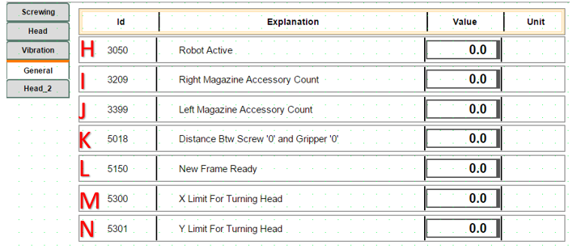
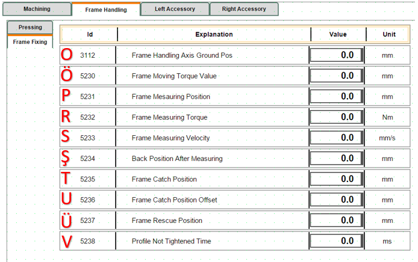

## 1. Machine Initial Startup Robot Gripper Mold Status

- When the system is first turned on, after reset, it asks for confirmation if there is a mold in the gripper.

*YES:* It places the mold it has in its designated spot, returns to the home position, and waits for communication with the job file.

*NO:* It waits for communication with the job file in the home position.

**NOTE:** If the job file is added manually, it will be done with the following three-step explanation. When the automatic system is running, it will pull from the system itself, so there will be no need to perform these operations.

- The exe file must be opened to read the job file.
- The prepared job file should be placed in the Robot File folder.
- When the Start button is pressed, the job file in the Robot File folder is read, data transfer from PLC to robot occurs, and after the information transfer is complete, the robot starts running the job file.

## 2. Robot Bypass and Line Independent Operation Mode

When the robot is not to be included in the operation, the following configuration should be applied to allow the line to continue working uninterrupted:

*Parameter Setting:* The "RobotActive" parameter on the robot control screen should be set to "0". When this setting is applied, the robot operation is automatically bypassed. The robot is disabled, allowing the line to operate independently.

*Work Flow (Frame Transfer):* Processed frames advance directly on the line and are directed to the transfer table located at the robot output.

## 3. Door Opening Permission Procedure

When the **"Door Opening Permission Button"** is pressed by the operator, the robot completes its active operation to protect mechanical safety and part integrity, then enters standby mode.

*Operation Completion Scenarios:*

If the system is running any of the following operations, it does not interrupt the process, but waits for the operation to complete:

- Screwing: The active screwing operation continues until the torque value is reached.

- Screw Feeding: The screw pulling or transfer operation is completed.

- Drilling: The drill tip is safely withdrawn from the workpiece.

- ..........

- ...........

When the active cycle is completed at a safe point, the system automatically opens the door locks and gives entry approval to the operator.

## 4. Emergency Stop - Stop Scenarios

*Emergency Stop Condition:*

When the Emergency Stop button is pressed, the active work cycle is canceled due to security protocols, and the system enters safe standby mode. After this process, since the system data is reset, restarting the job file from the beginning is mandatory.

*Steps to Reactivate the System:*

- The pressed Emergency Stop button is released.
- *A:* Alarms (Reset) are cleared from the operator panel.
- *B:* Reset is pressed. The robot performs "Go to Main", then **C** question panel opens.
- *C:* Inquiry is made whether there is a mold on the gripper or not. Subsequently, **D** question panel opens.
- *D:* A question panel opens regarding whether to continue with the same job file or a different job file after the emergency.

  *YES:* Continues with the job file in memory.

  *NO:* Waits for a different job file to be loaded. If it cannot read the job file for a certain period, it gives an error message that it could not read the file.

  *Stop Condition:*

When *E (Stop Button)* is pressed in the system, PLC and robot enter a coordinated "waiting mode". The technical operation of this process is as follows:

 - *PLC*, when the stop signal is received, freezes the current work step (state) and puts the system into "Stop State" mode.

 - *Robot*, instead of stopping movement immediately when the stop signal comes, continues to work until the next waiting signal step (checkpoint) to maintain process integrity. When the robot reaches that step, it stops and waits for the "status bit" from the PLC.

 - *Restarting the System:* When the operator presses **F (Start Button)**, the PLC activates the relevant status bit and directs the system back to the normal work cycle from the step it left off. Bu işlemden sonra sistem verileri sıfırlandığı için iş dosyasının en baştan başlatılması zorunludur.

*Sistemi Tekrar Aktif Hale Getirme Adımları:*

- Basılı olan Acil Stop butonu serbest bırakılır.
- *A:* Operatör panelinden Alarmlar (Reset) temizlenir.
- *B:* Reset e basılır . Robot Po to Main yapar arkasından **C** soru paneli açılır
- *C:* Gripper üzerinde kalıp var,yok sorgusu yapılır. Daha sonrasında **D** soru paneli açılır
- *D:* Acilden sonra aynı iş dosyası ile mi yoksa farklı bir iş dosyası ile mi çalışacağına dair soru paneli açılır.

  *YES:* Hafızadaki iş dosyası ile devam eder.

  *NO:*  Farklı iş dosyasının yüklenmesini bekler. Belli bir süre iş dosyasını okuyamazsa, dosya okuyamadığına dair hata mesajı verir.

  *Stop Durumu:*

When *E (Stop Button)* is pressed in the system, PLC and robot enter a coordinated "waiting mode". The technical operation of this process is as follows:

 - *PLC*, when the stop signal is received, freezes the current work step (state) and puts the system into "Stop State" mode.

 - *Robot*, instead of stopping movement immediately when the stop signal comes, continues to work until the next waiting signal step (checkpoint) to maintain process integrity. When the robot reaches that step, it stops and waits for the "status bit" from the PLC.

 - *Restarting the System:* When the operator presses **F (Start Button)**, the PLC activates the relevant status bit and directs the system back to the normal work cycle from the step it left off.

## 5. When Working with the Line, When Will the Frame Come from the Line, Is the Frame Coming from the Line the Same as the Frame on the Line?

For the line to work synchronously, the frame transfer and job file creation process proceeds according to the following criteria:

*Frame Arrival Condition:* If there is a ready frame at the exit table (Z) at the end of the line, the robot waits for the new frame request from the PLC.

*Job File Creation:* For the robot to start its operation, the frame at the (Z) table must have its job file created and defined in the system.

*Frame on Line vs Incoming Frame Check:* The frame IDs in the current frame at the (Z) table and in the job file coming from the PLC software must match each other. If there is a match, the robot starts the operation; if there is no match, it gives an incorrect job file alarm.

## 6. Alarm Conditions During Frame Clamping

When the system is ready and the frame reaches the exit sensor, when the axis approaches to clamp the frame but cannot clamp it sufficiently, it gives a **"Frame Measuring Error, Wrong Frame Sizes !"** error regarding measurement. To clamp again, press **(F) Start Button** and perform the clamping operation again.

## 7. Drilling Tool Not Ok Alarm Condition

*The system performs automatic tool control once at the beginning of each job to ensure operational safety. The process and what to do in case of error are specified below:*

- The robot touches the tool tip to a predefined control switch to verify the physical integrity of the drilling tool.

- If the verification signal is not received from the switch despite reaching the tool control point, the robot automatically stops movement. It moves to a safe waiting position (above the control point) and activates the status alarm on the operator panel.

*Intervention and Troubleshooting:*

- *Tool Damage:* If the drill bit is physically damaged or broken, it should be replaced with a new tool tip.

- *Sensor Check:* If no problem is observed on the tool tip, the functionality and cable connections of the relevant control sensor (switch) should be checked.

- *Reactivating the System:* After necessary physical corrections are made and the fault source is eliminated, press the **Start Button (F)** on the panel to continue the process from where it left off.

## 8. Accessory Not Ok Alarm Condition

For the accessory mounting process to proceed healthily, it is critical that the part is successfully taken from the magazine and positioned precisely within the mold. Therefore, the presence and position of the part are checked via sensors before proceeding to the mounting stage.

If the accessory brought to the control point by the robot is not detected by the sensor, the system generates an "AccessoryNotOk" alarm; the robot moves to waiting mode by rising slightly from the control point to allow operator intervention. The solution paths to be followed in this case are specified below:

*Continuing with Manual Intervention*

- If the accessory has come out of the magazine but remained on the magazine because it was not fully taken by the mold:

The operator opens the safety door (the system will go into Emergency Stop mode) and enters the line. Takes the accessory from the magazine and manually places it into the mold, paying attention to the direction of arrival. After exiting the line and closing the safety door, reset the system and press **F (Start Button)** on the panel to continue the process from where it left off.

*Retrying the Picking Operation (If Accessory is in Magazine)*

- If the accessory has remained in the magazine and the operator wants the robot to pick the same accessory again:

After exiting the line and activating the safety lock, press **B (Reset Button)** on the panel. With this operation, the robot will repeat the accessory picking cycle from the beginning.

*Condition Where No Accessory Comes Out of Magazine*

- If the robot has returned empty because no accessory came out of the magazine and has come to the waiting point:

After the error is fixed, press **B (Reset Button)** on the panel to restart the accessory picking operation.

## 9. Condition Where Screw Cannot Be Pulled to Jaw

The robot requests screw feeding from the system before the screwing operation. If the screw feeding fails, the operator should follow the steps below:

*Preliminary Check:*

- The operator should first visually check the screwing tip to confirm whether the screw has been sent or not.

*If Screw Feeding is Successful (Visual Confirmation):*

- If the screw has reached the tip and no problem is observed:

Since the line has been entered, the system safety circuits must be reset first. Then press **F (Start Button)** on the panel to continue the process from where it left off.

*If Screw Feeding Failed (Error Confirmation):*

- If it is confirmed in the visual check that the screw has not reached the tip:

Since the line has been entered, the system safety circuits must be reset first. Then press **B (Reset Button)** on the panel to retrigger the screw pulling operation.

## 10. PassNextAccessory to Skip Current Accessory Mounting

If any problem is encountered during the robot's drilling, screwing, or other operations, the following steps should be followed to intervene in the process without disrupting the current workflow:

*Stopping the Operation:*
- Press E (Stop Button) on the panel. This puts the robot into waiting mode.

*Caution:* If B (Reset Button) is pressed at this stage, the entire process state is reset and the process returns to the beginning.

## 11. Restarting the Operation and Options

- After stopping, when F (Start Button) is pressed, a decision page opens on the screen. The operator should choose one of the following two options at this stage:

*G:* Allows the robot to continue its operations from where it left off.

*H:* Allows the robot to cancel its current operation and proceed to the next accessory cycle.

*Critical Warning:* When option **H** is chosen, after the robot safely rescues itself, if there is a mold in the gripper, it will go to the drop point. Make sure that there is no accessory in the mold during the drop operation.

## 12. Accessory Mounting Alarm Definitions and Solution Steps

The alarms listed below are alarm messages that may occur during mounting.

**Screw Drop failed !** Section 9 summarizes this alarm condition.
**Screw did not move to jaw or Screw detector broken !** This is a "Screw Feeding Waiting Timeout" error. It is triggered when the system is in screw feeding mode and despite a certain period of time passing, the signal indicating that the screw has reached the target is not received from the Screw control sensor. The errors that may cause this error are as follows:

- **Feeding Hopper Empty:** The screw may not be left in the screw feeder vibrator or feeding unit.

- **Mechanical Jamming:** The screw may be stuck in the feeding hose or at the mouth, preventing it from reaching the sensor.

- **Air Pressure Issue:** The air pressure used to push the screw is insufficient.

- **Sensor Malfunction:** The ScrewCame sensor is not seeing the screw or may have physically shifted out of position.

## 13. Condition Where Axis Gets Stuck During Movement

Sometimes the robot cannot reach the point it wants to go mathematically or gets stuck in joint limits, even if it does not hit a physical obstacle. In these cases, the steps the operator should follow to rescue are as follows:

## 13.1. Diagnosing the Problem (Reading Error Message)

- If you see one of the following messages on the screen, the robot has entered a "geometric" deadlock:

*"Axis Limit":* The robot has reached the last point one of its joints can rotate.

*"Singularity"* (Singularity): The robot's wrist axes (4 and 6) have aligned, the robot has lost its direction.

*"Out of Reach":* The robot's arm cannot reach that point or follow that path.

## 13.2. Rescuing the Robot in Manual Mode (Jogging)

Turn the key to the right from the control unit to put it in **B (Manual Mode)**

- When the robot gives these errors, it usually refuses to move in "Linear" (Linear) mode. To relieve the robot:

*Change Movement Mode:* Change the movement mode to "Axis" (Axis) mode via FlexPendant. When **A** is pressed, you will see that **B** part changes between axes 1-3 and 4-6.

*Manually Rotate Axes:* If there is a limit error: Rotate the axis hitting the limit in the opposite direction with the joystick. The area where the axis to be worked on should be kept in **B**, and moved by looking at the image showing how the joystick directions work on the Jogging page.

*If there is Singularity:* Slightly move the 5th axis (wrist bending) up or down to make the axes come out of alignment.

*Pull to a Safe Point:* Move the robot away from the problematic point by about 5-10 cm and take it to empty space (safe area).

## 13.3. "Bypassing" the Operation and Continuing (Moving Program Pointer)

- What the operator should actually do is to rescue the robot from that "faulty point" and manually direct it to the next safe operation step. Follow these steps:

*Open Program Editor Page:* Enter the section on FlexPendant, press **A** from the menu bar and **B** to open the Program Editor page.

*Select the Next Step:* Touch and select the line below the line where the robot got stuck or the next operation start (e.g.: MoveL or MoveJ) in the code. Visual **C**. Do not skip command lines if there are command lines in between. To avoid getting stuck in states on the PLC side.

*Move the Cursor (PP to Cursor):* Press **D** "Debug" menu **E** "PP to Cursor" (Move Program Pointer to Selected Line) option.

After these operations, it would be healthy to first run manually to observe that the operation can continue. To proceed step by step manually, hold down the **F** Motor On button on the FlexPendant as shown in the visual. As shown in Visual **H**, while you hold it down, you see the Motor On text, you can proceed with operations manually in this way. Then, Visual **G** is used to execute each line step by step, advancing one line at a time with each press. If you do not want to go step by step in Visual **G**, when you press Visual **I**, it starts scanning all lines step by step. When you want to stop while the robot is running, you can press the Visual **J** Stop button or release your hand from the Visual **F** Motor On button. After running the robot, if the robot can go to the next step by itself, after this stage, you can switch the Robot to Automatic Mode and run it again.

*Automatic Mode and Start:* Turn the key to the **K** direction shown in the visual, confirm the questions coming to the FlexPendant screen, put the system in "Auto" mode, activate the motors by pressing the **L** part shown in the visual, and after clearing the alarms in the system, give Start to continue your operations.

*Speed Control:* Keep the speed at 10%-25% level while the robot makes its first movement and monitor its path. If no problem is observed, you can set the speed back to 100%. For the speed setting page, click on the **M-N** parts shown in the visual in sequence to open the **O** speed page.

## 14. Detailed Information About Parameters on Screen and Screwing Axis Speeds

 

 

**A:** Determines the Home position of the screwing axis group **(Parameter Value: 53)**.

The system automatically brings the axis to this position in the following situations:

End of Cycle: When a screw driving operation is successfully completed, to pick up a new screw or allow the part to pass.

Reset Operation: When the machine is reset (Reset) or returned to the starting position.

Screw Unload: During the transition to a safe waiting point after unloading the current screw in the system.

**B:** The speed used by the screwing axis group when returning Home after the operation is complete or in Reset condition. **(Parameter Value: 50)**

**C:** This parameter determines the physical zero reference point of the screwing tip. All working distances, diving depths, and approach positions are calculated with reference to this "0" point. **(Parameter Value: 82)**

**D:** This parameter is the speed used by the screwing group when moving to the working (Set) position. **(Parameter Value: 42)**

**E:** This parameter is the speed used by the screwing group when moving to the return (Reset) position. **(Parameter Value: 42)**

**F:** Accessory thickness, how many mm the screw head will remain outside, that is, information about the offset distance between the screw head and frame. **(Parameter Value: 1)**

**G:** The position where the screw comes from the feeding hose and is held by the jaws. The system brings the axis to this point during the screw feeding operation. It is the intermediate stop point where the screw comes from the feeding unit and enters the jaws, but is not yet screwed into the part. **(Parameter Value: 55)**

**H:** If the robot is in active working condition, it should be **(Parameter Value: 1)**. If there is a problem with the robot or I want to bypass it (condition in Item 2), it should be **(Parameter Value: 0)**.

**I:** Parameter related to how many accessories are in the right magazine **(Parameter Value: 29)**

**J:** Parameter related to how many accessories are in the left magazine **(Parameter Value: 19)**

**K:** The height difference between the '0' point of the Screwing Tool and the '0' point of the Gripper **(Parameter Value: 1.5)**

**L:** The moment when the operator physically feeds a new profile (frame) to the machine or the software confirms that a new profile is ready to be processed. The system does not start copying job data without seeing this signal. **(Parameter Value: 1)**

**M:** The limit value entered for the robot to be able to process accessories directionally to the right or left according to the robot's reach distance in the X plane. **(Parameter Value: 1500)**

**N:** The limit value entered for the robot to perform the drilling operation directionally according to the robot's reach distance in the Y plane. **(Parameter Value: 1950)**

**O:** 

**Ö:** This parameter determines the torque (force) limit that allows the frame transfer axis (AxisFrm) to stop when it grasps a frame or encounters an obstacle. The system continuously monitors whether this limit value is reached while the axis is moving. **(Parameter Value: ....)**

**P:** 

**R:** This value comes into play mostly during the precision measurement (metrology) stage. It keeps the torque at a low level to prevent the profile from stretching or being crushed by pressing too hard on the frame. **(Parameter Value: 0.5)**

**S:**

**Ş:**

**T:** When moving to grasp or measure a part, it uses this coordinate as the main target point. The software automatically updates this value with each new work order to determine where the axis "should find the part".

**U:** The correction value added to the basic grasping position (CatchPos) during the measurement operation. **(Parameter Value: 20)**

**Ü:**

## 15. General Working Principle with the Line
