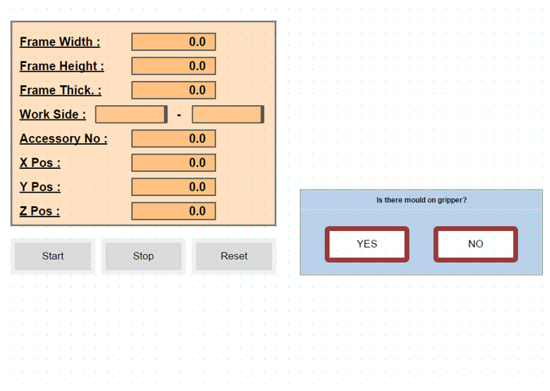
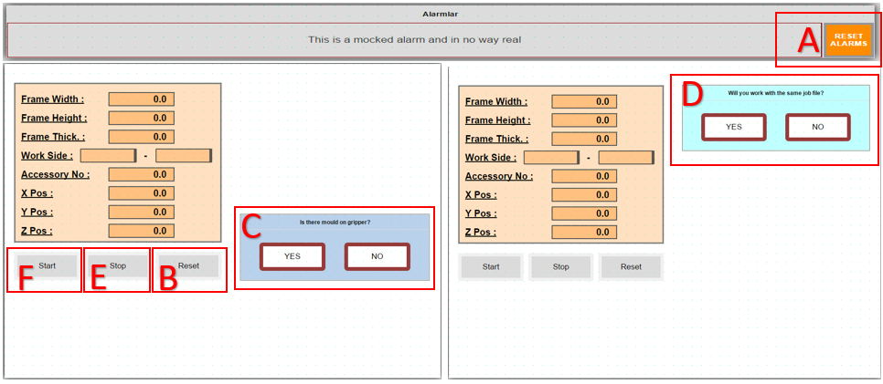
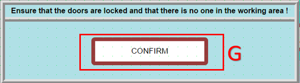
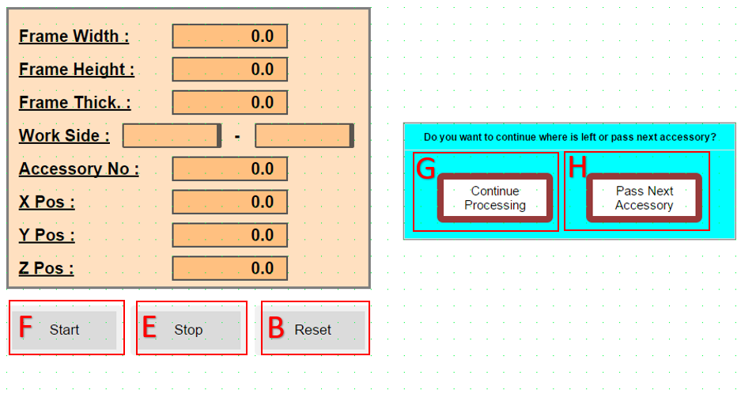
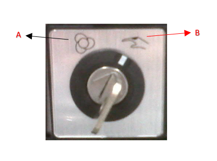
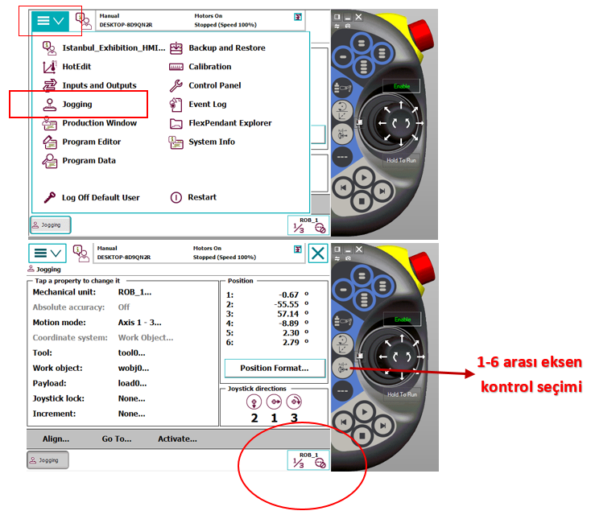
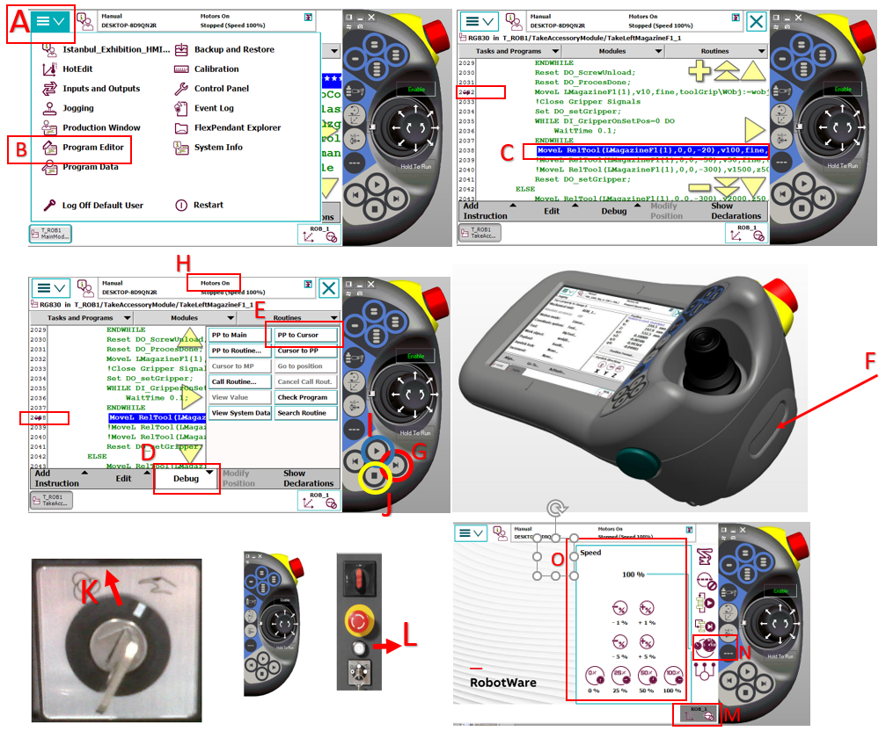
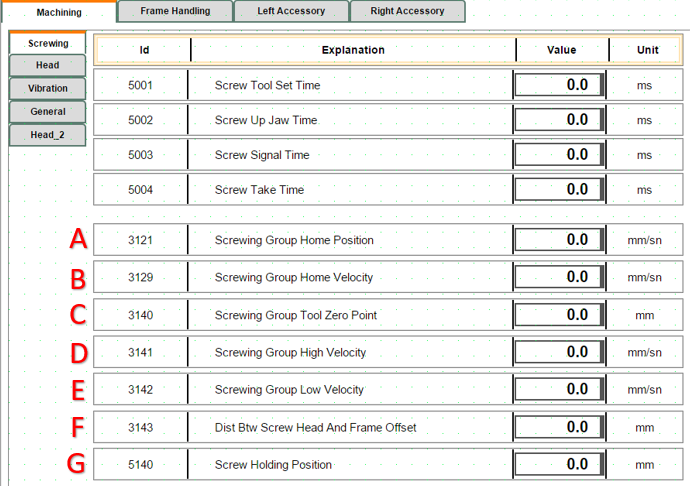
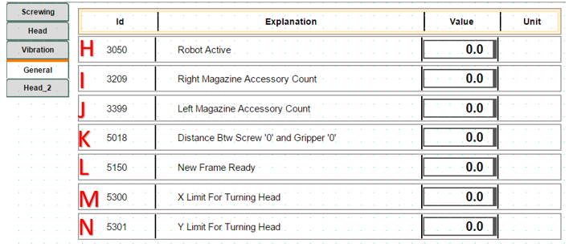
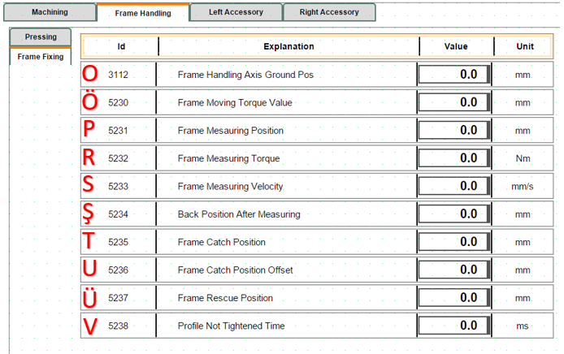

## IMPORTANT NOTES FOR THE CUSTOMER

1) There should always be accessories in the default molds.

2) When compressed air is lost, accessories may drop; when air returns they may rise again. During this event two accessories can emerge and jam the mold — check accessories that dropped when air is lost.

3) After an emergency stop, press the reset button on the line panel until the reset lamp lights to reinitialize the line.

4) If an emergency stop is pressed while the flip-up tables are moving, they may slip slightly but will stop afterward.

5) Emergency stops cut outputs both on the robot panel and the line panel, putting both systems into an emergency state. Unless it is a real emergency (for example a frame trapped between two tables) you can stop systems individually using their stop buttons.

6) Entering the guarded area resets the system. After exiting and issuing the door-lock command, first press the reset button on the line panel until its lamp lights.

7) If you want to stop the robot while the line is running, or stop the line while the robot is running: press the stop buttons on the relevant panel.

## 1. Robot Gripper Mold State on Initial Machine Power-Up

- On first power-up, after reset the system will request confirmation whether there is a mold in the gripper.

*YES:* The robot will place the mold it holds into its numbered slot, return to Home and wait for the job file.

*NO:* The robot will wait at Home for the job file.

NOTE: If the job file is added manually, follow the three steps below. During automatic operation the system will fetch the job file itself and manual steps are not required.

- Open the EXE so the job file can be read.
- Place the prepared job file into the Robot File folder.
- When Start is pressed, the job file in Robot File is read and PLC-to-robot data transfer occurs; after transfer the robot begins the job.

## 2. Robot Bypass and Independent Line Operation Mode

When the robot should not participate in the operation and the line must continue running, apply this configuration:

*Parameter Setting:* On the robot control screen set `RobotActive` to `0`. This bypasses the robot operation allowing the line to run standalone.

*Workflow (Frame Transfer):* Processed frames proceed directly along the line and are directed to the transfer table at the robot output.

## 3. Door Opening Permission Procedure

Door Open Permission Scenario:

- On the door switches:

    White button: Door open request

    Black button: Door lock command

- The door open request is approved when the three flip-up tables on the line are not moving up or down.
- Pressing the manual latch behind the door mechanically releases the lock — use only in urgent situations requiring immediate action.
- After opening the door, close both doors and press the black button to lock. Then confirm on-screen that doors are locked and the area is clear to resume operations.

When the operator presses the "Door Open Permission Button" the robot will finish its active operation, then stop to preserve mechanical safety and part integrity.

Operation Completion Scenarios:

If any of the following is active the system will not interrupt the process and will wait for completion:

- Screwing: the active screwing continues until the torque setpoint is reached.

- Screw feeding: screw pick or transfer completes.

- Drilling: the drill bit retracts safely from the workpiece.

When the active cycle completes at a safe point, the system will automatically unlock the door and permit operator entry.

## 4. Emergency Stop / Reset and Stop/Start Scenarios

### 4.1 Emergency Stop - Reset

When an emergency stop is pressed the active cycle is cancelled by the safety protocol and the system enters a safe-stop mode. To return the system to its initial running state follow these steps:

Steps to Reactivate the System:

- A: Clear alarms (Reset) on the operator panel.
- Press the reset button on the line panel until its lamp lights.
- B: Press Reset. The robot performs Po to Main and then panel C question appears.
- C: The system asks whether there is a mold on the gripper; then panel D appears.
- D: The system asks whether to continue with the same job file or a different job file after the emergency.

    YES: Continue with the job file in memory.

    NO: Wait for a different job file to be loaded. If the file cannot be read within the timeout the system will report a file-read error.

### 4.2 Stop - Reset

When `E (Stop Button)` is pressed the PLC and robot enter a coordinated wait mode. Technical behavior:

- PLC freezes the current state and sets the system into "Stop State" mode.

- Robot, if it is not actively screwing, feeding, or drilling, decelerates to zero upon the PLC stop signal and waits at the current program line.

- Restarting: If no alarms exist continue from step B; if alarms exist, follow the Emergency Stop - Reset steps.

### 4.3 Emergency Stop - Start

- Pressing emergency stop cuts outputs from both the line and robot panels.
- To enter the guarded area press the door open permission button (White Button).
- After entry and exit, close the door and press the black button to lock it.
- Release emergency stops and press the reset button on the line panel until the reset lamp lights.

- After confirming on-screen that the area is clear the system resumes from where it stopped.

### 4.4 Stop - Start

- To stop without entering the guarded area press Stop; press Start to resume.
- To enter the guarded area press door open permission (White Button); after exit close doors and press black button to lock.
- Press the reset button on the line panel until the reset lamp lights.

- G: After confirming the area is empty the system continues where it left off.

## 5. Line Synchronization: When Will a Frame Arrive and Does It Match the Incoming Frame?

For line synchronization, frame transfer and job file assignment proceed under these rules:

*Frame Arrival Condition:* The robot PLC requests a new frame when a ready frame is present on the output table (Z).

*Job File Creation:* The frame on the (Z) table must have a created and registered job file for the robot to start processing.

*Frame Match Check:* The frame ID in the job file from PLC must match the ID of the frame on (Z). If matched the robot starts; if not, a wrong-job-file alarm occurs.

## 6. Alarms During Frame Clamping

When the frame arrives at the clamping sensor and the clamping axis cannot clamp sufficiently the system raises **"Frame Measuring Error, Wrong Frame Sizes !"**. Press **F (Start Button)** to retry clamping.

## 7. Drilling Tool Not Ok Alarm

The system performs an automatic tool check once at the start of each job for safety. Process and corrective steps:

- The robot touches the drill tip to a predefined check switch to verify tool integrity.

- If the tool tip triggers the sensor the operation continues.

- If no confirmation signal is received the robot stops, moves to a safe waiting position above the check point and raises an alarm on the operator panel.

Intervention and Troubleshooting:

- Tool Damage: If the drill tip is damaged replace it.

- Sensor Check: If the tool appears fine, verify sensor function and wiring.

- Restart: After repairs press **Start (F)** on the operator panel to continue the cycle.

## 8. Accessory Not Ok Alarm

Assembly requires the part to be picked from the magazine and precisely placed in the mold. Presence and position are checked by sensors.

If the accessory at the control point is not detected the system raises an "AccessoryNotOk" alarm; the robot raises slightly and waits for operator intervention. Recommended recovery:

Manual Intervention:

- If the accessory left the magazine but was not taken by the mold and remains on the magazine:

    Open the safety door (system enters Emergency Stop), enter the line, remove the accessory and manually place it in the mold with correct orientation. Exit, close the door, reset and press **F (Start)** to resume.

Repeat Pick (if accessory remains in magazine):

- If the accessory remains in the magazine and you want the robot to pick it again:

    Exit the line, enable safety interlock and press **B (Reset Button)** on the panel. The robot will repeat the pick cycle from the beginning.

No Accessory Released:

- If no accessory was released and the robot returned empty to wait:

    After clearing the fault press **B (Reset Button)** to restart accessory pickup.

## 9. Unable to Insert Screw into Jaw

Before screwing the robot requests a screw feed. If screw feeding fails the operator should:

Pre-check:

- Visually inspect the screw tip to confirm delivery.

If Screw Delivery Succeeded (visual):

- Reset safety circuits (because you entered the line) then press **F (Start)** to continue.

If Screw Not Delivered:

- Reset safety circuits then press **B (Reset Button)** to re-trigger screw feed.

## 10. PassNextAccessory to Skip Current Accessory

If an issue occurs during drilling, screwing or other operations and you need to intervene without disrupting the flow:

Stop the operation:
- Press **E (Stop Button)** on the panel to put the robot into wait mode.

Caution: Pressing **B (Reset Button)** here will reset the entire process state and return to the start.

## 11. Restart Options After a Stop

- After stopping, when **F (Start Button)** is pressed a decision screen appears. Choose one option:

G: Continue from where the robot stopped.

H: Cancel current operation and proceed to next accessory cycle.

Critical: If **H** is chosen, after the robot frees itself it will go to the drop-off point and if a mold is in the gripper it will place it. Ensure the mold is empty during drop-off.

## 12. Accessory Assembly Alarm Definitions and Remedies

The following alarms may occur during assembly.

**Screw Drop failed !** See item 9.
**Screw did not move to jaw or Screw detector broken !** This is a "Screw Feed Timeout" alarm triggered when no signal from the screw detector is received within expected time. Possible causes:

- Feed hopper empty: no screws left in the vibratory feeder/feed unit.

- Mechanical jam: screw stuck in feed hose or mouth and cannot reach sensor.

- Air pressure issue: insufficient air pressure to feed the screw.

- Sensor fault: ScrewCame sensor not detecting the screw or displaced.

## 13. Axis Stuck While Moving

The robot may become mathematically unable to reach a point or hit joint limits even without a physical obstacle. Rescue steps:

### 13.1 Diagnose (Read Error Message)

- If you see one of these messages, the robot has entered a "geometric" trap:

"Axis Limit": A joint has reached its rotational limit.

"Singularity": Wrist axes (4 and 6) are aligned and the robot loses orientation.

"Out of Reach": The robot arm cannot reach or follow the trajectory.

### 13.2 Rescue in Manual Mode (Jogging)

Switch the control key to the right to enter **B (Manual Mode)**.

- When these errors occur the robot often refuses linear moves. To relieve:

*Change Move Mode:* Set movement mode to "Axis" on the FlexPendant. Press **A** to toggle axis ranges 1-3 and 4-6 shown in **B**.

*Manually rotate axes:* If a limit error occurs rotate the limiting axis slightly in the opposite direction with the joystick while in the correct axis range.

*If Singularity:* Move axis 5 slightly up or down to break alignment.

*Move to a Safe Point:* Move the robot 5-10 cm away from the problem point into free space.

### 13.3 Skip and Continue (Program Pointer Move)

- Free the robot from the stuck line and manually direct it to the next safe program step:

*Open Program Editor:* On the FlexPendant open the Program Editor via menu **A** then **B**.

*Select Next Step:* Touch the line immediately after the stuck line or the next operation start (MoveL or MoveJ) to select it. Do not skip intermediate command lines to avoid PLC state mismatch.

*PP to Cursor:* From the Debug menu choose "PP to Cursor" to move the program pointer to the selected line.

After this, run manually to verify safe continuation. For step execution press and hold Motor On (visual **F**) and use visual **G** to step each line. Pressing **I** will step through automatically. To stop, press the Stop button (visual **J**) or release Motor On **F**. If the robot advances successfully switch to Auto and resume.

*Auto Mode and Start:* Turn the key toward **K**, confirm prompts, set Auto mode, enable motors via **L**, clear alarms and press Start.

*Speed Control:* Initially run at 10–25% speed and monitor. If ok, raise to 100%. Open speed via visuals **M-N** then **O**.

## 14. Parameter Screen and Screw Axis Speed Details

**A:** Defines Home position for screw axis group (Parameter Value: 53).

The system moves the axis to this position automatically in these cases: end of cycle, reset, or unload.

**B:** Speed used when returning Home after operation or on Reset (Parameter Value: 50).

**C:** Defines the physical zero reference of the screw tip used for all distances and approach positions (Parameter Value: 82).

**D:** Speed used when moving to the Set (working) position (Parameter Value: 42).

**E:** Speed used when returning to Reset position (Parameter Value: 42).

**F:** Accessory thickness — offset between screw head and frame (Parameter Value: 1).

**G:** Intermediate position where the screw is held by the jaws after feed (Parameter Value: 55).

**H:** Robot active flag: set to 1 if robot is active, 0 to bypass (see item 2).

**I:** Number of accessories in the right magazine (Parameter Value: 29).

**J:** Number of accessories in the left magazine (Parameter Value: 19).

**K:** Height difference between the screw tool zero and the gripper zero (Parameter Value: 1.5).

**L:** Set to 1 for standalone robot tests, 0 for synchronized line operation.

**M:** X-range access limit for accessory handling (Parameter Value: 1500).

**N:** Y-range access limit for drilling orientation (Parameter Value: 1950).

**Ö:** Torque limit for frame transfer axis to stop when encountering an obstruction (Parameter Value: ...).

**R:** Low torque used during metrology to avoid deforming the profile (Parameter Value: 0.5).

**T:** Main target coordinate used for pick or measure movements; updated automatically per job.

**U:** Correction added to the catch position during measurement (Parameter Value: 20).

## 15. Alarmlar

[ALM:....] : Bütün ileri gidemedi ya da geri gidemedi alarmları aslında pistonun sıkışmış olması anlamına gelmektedir.
             Manuel sayfadan ters yönde hareket ettirerek sıkışmayı giderdikten sonra Reset Alarms butonuna basınız.

[ALM:5010] : Vida düşürme hatası. Hava hortumunu kontrol edin.
	     Eğer vida hortum içinde ise Start butonuna basarak kaldığı yerden devam edin. Aksi takdirde Reset butonuna basarak tekrar vida çekmeyi deneyin.

[ALM:3022] : Aksesuar alma başarısız oldu. Kalıbı kontrol edin, gerçekten alamadıysa;
             Tekrar denemek isterseniz kalıbı ve aksesuar çıkış noktasını boşaltıp Reset butonuna basınız,
             Ya da aksesuarı manuel olarak kalıba yerleştirip Start butonuna basarak, prosesi hızlandırabilirsiniz.

[ALM:3029] : Delme tool algılanamadı. Eğer kırıldı ise değiştirin,
             Eğer bir sorun yoksa Start butonuna basarak devam edebilirsiniz.

[ALM:3120] : Vidalama grup eksen hatası, Reset alarms butonuna basarak alarmı resetlemeyi deneyin, aksi takdirde sistemi kontrol edin

[ALM:3100] : Vidalama eksen hatası, Reset alarms butonuna basarak alarmı resetlemeyi deneyin, aksi takdirde sistemi kontrol edin

[ALM:3794] : Sağ magazin 3.kat 1.aksesuar(20) algılanmadı. Ya alma noktasına aksesuar yerleştirin ve Reset Alarms butonuna basınız. Ya da Reset Alarms butonuna basarak tekrar aksesuar hazırlamayı dene.

[ALM:3795] : Sağ magazin 3.kat 2.aksesuar(21) algılanmadı. Ya alma noktasına aksesuar yerleştirin ve Reset Alarms butonuna basınız. Ya da Reset Alarms butonuna basarak tekrar aksesuar hazırlamayı dene.

[ALM:3796] : Sağ magazin 3.kat 3.aksesuar(22) algılanmadı. Ya alma noktasına aksesuar yerleştirin ve Reset Alarms butonuna basınız. Ya da Reset Alarms butonuna basarak tekrar aksesuar hazırlamayı dene.

[ALM:3797] : Sağ magazin 3.kat 4.aksesuar(23) algılanmadı. Ya alma noktasına aksesuar yerleştirin ve Reset Alarms butonuna basınız. Ya da Reset Alarms butonuna basarak tekrar aksesuar hazırlamayı dene.

[ALM:3798] : Sağ magazin 3.kat 5.aksesuar(24) algılanmadı. Ya alma noktasına aksesuar yerleştirin ve Reset Alarms butonuna basınız. Ya da Reset Alarms butonuna basarak tekrar aksesuar hazırlamayı dene.

[ALM:3799] : Sağ magazin 3.kat 6.aksesuar(25) algılanmadı. Ya alma noktasına aksesuar yerleştirin ve Reset Alarms butonuna basınız. Ya da Reset Alarms butonuna basarak tekrar aksesuar hazırlamayı dene.

[ALM:3800] : Sağ magazin 3.kat 7.aksesuar(26) algılanmadı. Ya alma noktasına aksesuar yerleştirin ve Reset Alarms butonuna basınız. Ya da Reset Alarms butonuna basarak tekrar aksesuar hazırlamayı dene.

[ALM:3801] : Sağ magazin 3.kat 8.aksesuar(27) algılanmadı. Ya alma noktasına aksesuar yerleştirin ve Reset Alarms butonuna basınız. Ya da Reset Alarms butonuna basarak tekrar aksesuar hazırlamayı dene.

[ALM:3802] : Sağ magazin 3.kat 9.aksesuar(28) algılanmadı. Ya alma noktasına aksesuar yerleştirin ve Reset Alarms butonuna basınız. Ya da Reset Alarms butonuna basarak tekrar aksesuar hazırlamayı dene.

[ALM:3803] : Sağ magazin 3.kat 10.aksesuar(29) algılanmadı. Ya alma noktasına aksesuar yerleştirin ve Reset Alarms butonuna basınız. Ya da Reset Alarms butonuna basarak tekrar aksesuar hazırlamayı dene.

[ALM:5235] : Çerçeve sabitleme işlemi başarısız oldu. Çerçeve ölçülerini kontrol ediniz eğer doğru ise Reset alarms butonuna basarak tekrar deneyin
