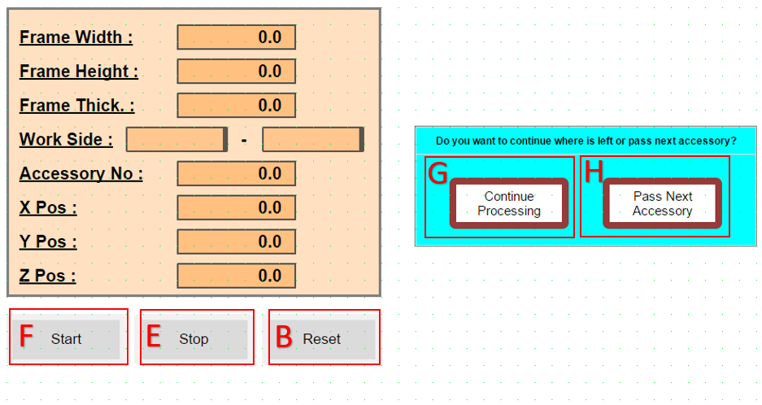
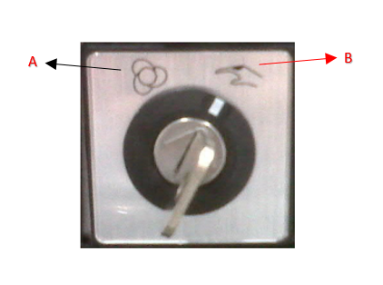
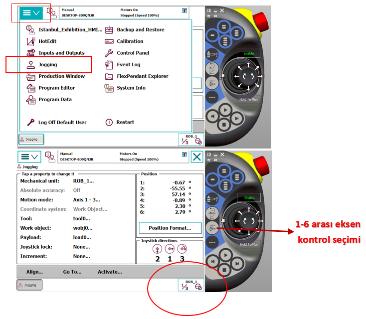
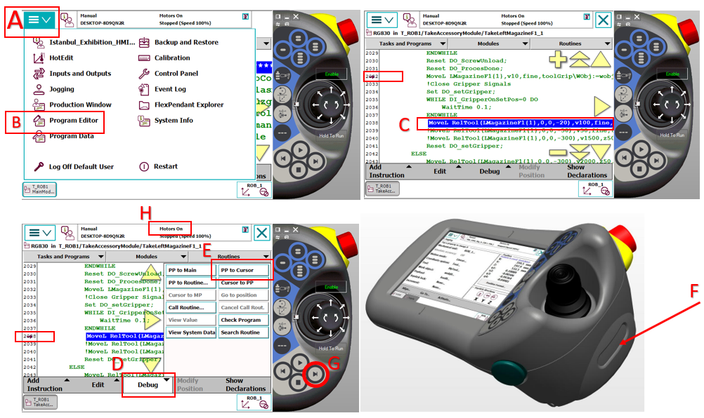

## Makine İlk Açılışta Robot Gripper Kalıp Durumu

- Sistem ilk açıldığında resetleme sonrası gripperda kalıp olup olmadığının teyitini ister.

**YES:** Elinde olan kalıbı kendi numarasındaki yere bırakarak tekrar home pozisyonuna döner ve iş dosyası ile haberleşmeyi bekler.

**NO:**  Home pozisyonunda iş dosyası ile haberleşmeyi bekler.

- İş dosyasının okunabilmesi için exe dosyası açılmalıdır.
- Hazırlanan iş Dosyası Robot File klasörünün içine konulmalıdır.
- Start butonuna basıldığında Robot File klasöründeki iş dosyası okunarak Plc den robota veri aktarımı gerçekleşir bilgi aktarımı tamamlandıktan sonra Robot iş dosyasını çalışmaya başlar.

## Robot Pasif Konuma Alonması Hatıın Devem Etmesi

## Kapıların açılma İzin Prosedürü

- Giriş bölümünde bulunan emniyet izin butonuna basıldığında, sistem mevcut çalışma döngüsünü (cycle) güvenli bir noktada tamamlar. Döngü bitiminin ardından sistem otomatik olarak kapı açma onayını verir.

## Acil Stop - Stop senaryoları.

**Acil Stop Durumu:** 

Acil Stop butonuna basılması durumunda güvenlik protokolü gereği aktif iş çevrimi (cycle) iptal edilir ve sistem güvenli duruş moduna geçer. Bu işlemden sonra sistem verileri sıfırlandığı için iş dosyasının en baştan başlatılması zorunludur.

**Sistemi Tekrar Aktif Hale Getirme Adımları:**

- Basılı olan Acil Stop butonu serbest bırakılır.
- **A:** Operatör panelinden Alarmlar (Reset) temizlenir.
- **B:** Reset e basılır . Robot Po to Main yapar arkasından **C** soru paneli açılır
- **C:** Gripper üzerinde kalıp var,yok sorgusu yapılır. Daha sonrasında **D** soru paneli açılır
- **D:** Acilden sonra aynı iş dosyası ile mi yoksa farklı bir iş dosyası ile mi çalışacağına dair soru paneli açılır.

  **YES:** Hafızadaki iş dosyası ile devam eder.

  **NO:**  Farklı iş dosyasının yüklenmesini bekler. Belli bir süre iş dosyasını okuyamazsa, dosya okuyamadığına dair hata mesajı verir.

  **Stop Durumu:**

Sistemde **E (Stop Butonu)**'na basıldığında, PLC ve robot koordineli bir "bekleme moduna" geçer. Bu sürecin teknik işleyişi şu şekildedir:

 - **PLC**, stop sinyali alındığında, mevcut çalışma adımını (state) dondurarak sistemi "Stop State" moduna alır.

 - **Robot**, stop sinyali geldiği anda hareketi kesmek yerine, işlem bütünlüğünü korumak adına bir sonraki beklemeli sinyal adımına (checkpoint) kadar çalışmaya devam eder.Robot ilgili adıma ulaştığında durur ve PLC’den gelecek olan "durum bitini" beklemeye başlar.

 - **Sistemi Yeniden Başlatma :** Operatör tarafından **F (Start Butonu)**'na basıldığında, PLC ilgili durum bitini aktif ederek sistemi kaldığı adım üzerinden tekrar normal çalışma döngüsüne yönlendirir.

## Hat ile çalışacağı zaman, hattan çerçeve ne zaman gelecek, Hattaki çerçeve ile gelen çerçeve aynı mı

## Çerçeve sıkıştırma da alarm durumları

## Drilling Tool Not Ok Alarm Durumu

**Sistem, operasyon güvenliğini sağlamak adına her iş başlangıcında bir kez olmak üzere otomatik takım kontrolü gerçekleştirir. Sürecin işleyişi ve hata durumunda yapılması gerekenler aşağıda belirtilmiştir:**

- Robot, delme takımının (tool) fiziksel bütünlüğünü doğrulamak amacıyla takım ucunu önceden tanımlanmış bir kontrol siviçine (switch) temas ettirir.

- Takım kontrol noktasına ulaştığı halde siviçten doğrulama sinyali alınamazsa, robot otomatik olarak hareketi durdurur. Güvenli bir bekleme pozisyonuna (kontrol noktasının üst kısmı) geçerek operatör panelinde durum alarmını aktif hale getirir.

**Müdahale ve Arıza Giderme:**

- **Takım Hasarı:** Eğer delme ucu fiziksel olarak zarar görmüş veya kırılmışsa, yeni bir takım ucu ile değiştirilmelidir.

- **Sensör Kontrolü:** Takım ucunda bir sorun gözlemlenmiyorsa, ilgili kontrol sensörünün (switch) işlevselliği ve kablo bağlantıları kontrol edilmelidir.

- **Sistemi Tekrar Devreye Alma:** Gerekli fiziksel düzeltmeler yapıldıktan ve arıza kaynağı giderildikten sonra, operatör paneli üzerinden **Start Butonuna (F)** basılarak işlem döngüsü kaldığı yerden devam ettirilir.

## Accessory Not Ok Alarm Durumu

Aksesuar montaj sürecinin sağlıklı ilerleyebilmesi için parçanın magazinden başarıyla alınması ve kalıp içerisinde hassas şekilde konumlanması kritik önem taşımaktadır. Bu doğrultuda, montaj aşamasına geçilmeden önce parçanın varlığı ve konumu sensörler aracılığıyla denetlenir.

Robot tarafından kontrol noktasına getirilen aksesuarın sensör tarafından algılanmaması durumunda sistem "AccessoryNotOk" alarmı üretir; robot, operatör müdahalesine imkan tanımak için kontrol noktasından bir miktar yükselerek bekleme moduna geçer. Bu durumda izlenmesi gereken çözüm yolları aşağıda belirtilmiştir:

**Manuel Müdahale ile Devam Etme**

- Eğer aksesuar magazinden çıkmış fakat kalıp tarafından tam alınamadığı için magazin üzerinde kalmışsa:

Operatör, emniyet kapısını açarak (sistem Acil Stop moduna geçecektir) hattın içerisine girer. Magazindeki aksesuarı alarak, geliş yönüne dikkat ederek el ile manuel olarak kalıba yerleştirir.Hattan çıkıp emniyet kapısını kapattıktan sonra sistemi resetleyip panel üzerinden *F (Start Buton)*'una basarak süreci kaldığı yerden devam ettirir.

**Alma İşleminin Tekrarlanması (Aksesuar Magazindeyse)**

- Eğer aksesuar magazinde kalmışsa ve operatör bu parçanın robot tarafından tekrar alınmasını istiyorsa:

Hattan çıktıktan ve emniyet kilidini devreye aldıktan sonra panel üzerindeki *B (Reset Butonu)*'na basılır. Bu işlemle birlikte robot, aynı aksesuarı alma döngüsünü en baştan tekrarlayacaktır.

**Magazinden Aksesuar Çıkmaması Durumu**

- Eğer magazinden hiç aksesuar çıkmadığı için robot boş dönmüş ve bekleme noktasına gelmişse:

Hata giderildikten sonra panel üzerinden *B (Reset Butonu)*'na basılarak aksesuar alma işlemi yeniden başlatılır.

## Çeneye Vida Çekilememe Durumu

Robot, vidalama işlemi öncesinde sistemden vida besleme talebinde bulunur. Vida beslemesinin başarısız olması durumunda operatör aşağıdaki adımları izlemelidir:

**Ön Kontrol:**

- Operatör, öncelikle vidalama ucunu gözle kontrol ederek vidanın gönderilip gönderilmediğini teyit etmelidir.

**Vida Gönderimi Başarılı İse (Görsel Onay):**

- Eğer vida uca ulaşmışsa ve herhangi bir sorun gözlemlenmiyorsa:

Hattın içerisine girildiği için öncelikle sistem emniyet devreleri resetlenmelidir.Ardından panel üzerindeki *F (Start Butonu)*'na basılarak işlem kaldığı yerden devam ettirilmelidir.

**Vida Beslenemedi İse (Hata Onayı):**

- Eğer görsel kontrolde vidanın uca ulaşmadığı teyit edilirse:

Hattın içerisine girildiği için öncelikle sistem emniyet devreleri resetlenmelidir. Ardından panel üzerindeki *B (Reset Butonu)*'na basılarak vida çekme işlemi yeniden tetiklenmelidir.

## Aktüel Aksesuar Montajını Geçmek için PassNextAccessory

Robotun delme, vidalama veya diğer operasyonları sırasında herhangi bir sorunla karşılaşılması durumunda, mevcut iş akışını bozmadan sürece müdahale etmek için aşağıdaki adımlar izlenmelidir:

**İşlemin Durdurulması:**
- Panel üzerinden E (Stop Butonu)'na basılmalıdır. Bu işlem robotu bekleme moduna alır.

**Dikkat:** Bu aşamada B (Reset Butonu)'na basılırsa, tüm işlem durumu (state) sıfırlanır ve süreç en başa döner.

**İşlemin Yeniden Başlatılması ve Seçenekler:**

- Durdurma işleminden sonra F (Start Butonu)'na basıldığında, ekranda bir karar sayfası açılır. Operatör bu aşamada şu iki seçenekten birini tercih etmelidir:

**G:** Robotun, kaldığı yerden işlemlerine devam etmesini sağlar.

**H:** Robotun, mevcut işlemini iptal ederek bir sonraki aksesuar döngüsüne geçmesini sağlar.

*Kritik Uyarı:* **H** seçeneği tercih edildiğinde robot kendisini güvenli bir şekilde kurtardıktan sonra Gripper da kalıp varsa bırakma noktasına gidecektir. Bırakma işlemi sırasında kalıpta aksesuar bulunmadığından emin olunmalıdır.

## Aksesuar Montaj Alarm Tanımları ve Çözüm Adımları

Aşağıda belirtilen alarmlar montaj esnasında meydana gelebilecek alarm mesajlarıdır.

- Left/Right Magazine Accessory 1 could not go backward ! / Left/Right Magazine Accessory 1 could not go forward !
- Vertical Clamp could not go backward ! / Vertical Clamp could not go forward !
- Horizontal Clamp could not go backward ! / Horizontal Clamp could not go forward !
- Gripper Move could not go backward !
- Screw Type Valve could not go backward ! / Screw Type Valve could not go forward ! 
- Left/Right Screw Drop could not go backward ! / Left/Right Screw Drop could not go forward !
- Screwing Axis Error !
- Screwing Axis Speed Error !
- Screwing Axis Minimum Limit Error ! / Screwing Axis Maximum Limit Error !
- Screwing Axis Lag Error !
- Axis Screw Group Minimum Limit Error ! / Axis Screw Group Maximum Limit Error !
- Axis Screw Group Lag Error !
- Screw Drop failed !
- Screw did not move to jaw or Screw detector broken !
- Right Magazine Hinge1 Left Bottom Clamp could not go backward ! / Right Magazine Hinge1 Left Bottom Clamp could not go forward !
- Right Magazine Hinge1 Left Top Clamp could not go backward ! / Right Magazine Hinge1 Left Top Clamp could not go forward !
- Right Magazine Hinge1 Right Bottom Clamp could not go backward ! / Right Magazine Hinge1 Right Bottom Clamp could not go forward !
- Right Magazine Hinge1 Right Top Clamp could not go backward ! / Right Magazine Hinge1 Right Top Clamp could not go forward !

## Eksen Hareket halindeyken Sıkışması Durumu

Robot bazen fiziksel bir engele çarpmadığı halde, gitmek istediği noktaya matematiksel olarak ulaşamaz veya eklem limitlerine takılır. Bu durumlarda operatörün kurtarması için izleyeceği adımlar şunlardır:

**1. Sorunu Teşhis Etme (Hata Mesajı Okuma)**

- Ekranda aşağıdaki mesajlardan birini görüyorsanız robot "geometrik" bir çıkmaza girmiştir:

**"Axis Limit":* *Robot bir ekleminin dönebileceği son noktaya gelmiştir.

**"Singularity"** (Tekillik): Robotun bilek eksenleri (4 ve 6) aynı hizaya gelmiş, robot yönünü şaşırmıştır.

**"Out of Reach":** Robotun kolu o noktaya yetişemiyor veya o rotayı takip edemiyordur.

**2. Robotu Manuel Modda Kurtarma (Jogging)**

Kontrol ünitesinden anahtarı saga çevirerek *B (Manuel Mod)*'a alın

- Robot bu hataları verdiğinde genellikle "Linear" (Doğrusal) modda hareket etmeyi reddeder. Robotu rahatlatmak için:

**Hareket Modunu Değiştirin:** FlexPendant üzerinden hareket modunu "Axis" (Eksen) moduna getirin.

*A* tuşuna basıldığında **B** kısmının 1-3 ve 4-6 arasında eksen olarak değiştiğini göreceksiniz. 

**Eksenleri Manuel Döndürün:** Limit hatası varsa: Sınıra dayanan ekseni ters yöne doğru joystick ile çevirin.

Hangi eksen arasında çalışılacaksa o alanda *B* kalınmalı ve Jogging sayfasındaki joystick yönlerinin nasıl çalıştığını gösteren görsele bakarak hareket ettirebilirsiniz.

**Tekillik (Singularity) varsa:** 5. ekseni (bilek bükme) hafifçe yukarı veya aşağı hareket ettirerek eksenlerin aynı hizadan çıkmasını sağlayın.

**Güvenli Bir Noktaya Çekin:** Robotu, sorun yaşadığı noktadan yaklaşık 5-10 cm uzaklaştırıp boşluğa (güvenli alana) alın.

**3. İşlemi "Atlatma" ve Devam Ettirme (Program Pointer Taşıma)**

- Operatörün asıl yapması gereken, robotu o "hatalı noktadan" kurtarıp bir sonraki güvenli işlem adımına manuel olarak yönlendirmektir.şu adımları izleyin:

**Program Editor Sayfasını Açın:** FlexPendant'ta  kısmına girin.

**Bir Sonraki Adımı Seçin:** Kod içerisinde robotun takıldığı satırın bir altındaki veya bir sonraki işlem başlangıcı olan (Örn: MoveL veya MoveJ) satıra dokunarak seçili hale getirin.

**İmleci Taşıyın (PP to Cursor):** "Debug" menüsünden "PP to Cursor" (Program İmlecini Seçili Satıra Taşı) seçeneğine basın.

**UYARI !:** Robot şimdi bir sonraki adımdan başlayacaktır, aradaki mesafeye dikkat edin!

**Otomatik Mod ve Start:** Sistemi "Auto" moduna alın, motorları açın ve Start butonuna basın.

**Hız Kontrolü:** Robot ilk hareketini yaparken hızı %10-%25 seviyesinde tutarak yörüngesini izleyin.

**4. Operatör İçin Kritik İpuçları**

**Linear vs Axis:** Eğer joystick'i ittiğinde robot "Limit" diyorsa, hemen hareket modunu "Axis" (Eksen) yap. Eksen modunda robot her zaman hareket eder.
