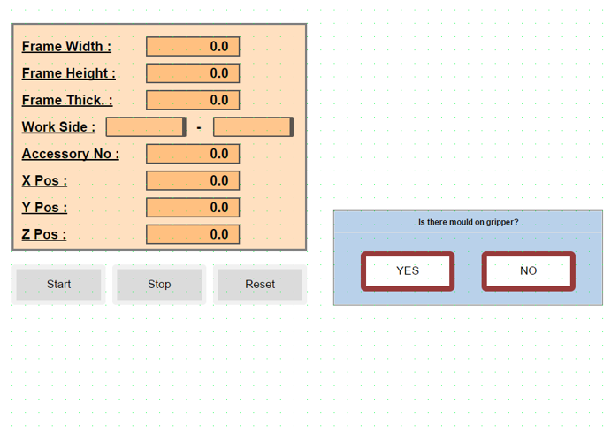
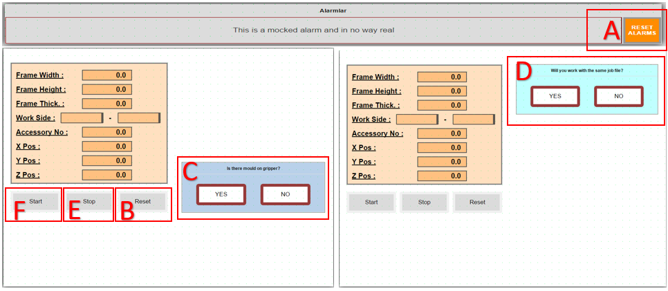

## Makine İlk Açılışta Robot Gripper Kalıp Durumu

- Sistem ilk açıldığında resetleme sonrası gripperda kalıp olup olmadığının teyitini ister.

**YES:** Elinde olan kalıbı kendi numarasındaki yere bırakarak tekrar home pozisyonuna döner ve iş dosyası ile haberleşmeyi bekler.

**NO:**  Home pozisyonunda iş dosyası ile haberleşmeyi bekler.

- İş dosyasının okunabilmesi için exe dosyası açılmalıdır.
- Hazırlanan iş Dosyası Robot File klasörünün içine konulmalıdır.
- Start butonuna basıldığında Robot File klasöründeki iş dosyası okunarak Plc den robota veri aktarımı gerçekleşir bilgi aktarımı tamamlandıktan sonra Robot iş dosyasını çalışmaya başlar.

## Robot Pasif Konuma Alonması Hatıın Devem Etmesi

## Kapıların açılma İzin Prosedürü

- Giriş bölümünde bulunan emniyet izin butonuna basıldığında, sistem mevcut çalışma döngüsünü (cycle) güvenli bir noktada tamamlar. Döngü bitiminin ardından sistem otomatik olarak kapı açma onayını verir.

## Acil Stop - Stop senaryoları.

**Acil Stop Durumu:** 

Acil Stop butonuna basılması durumunda güvenlik protokolü gereği aktif iş çevrimi (cycle) iptal edilir ve sistem güvenli duruş moduna geçer. Bu işlemden sonra sistem verileri sıfırlandığı için iş dosyasının en baştan başlatılması zorunludur.

**Sistemi Tekrar Aktif Hale Getirme Adımları:**

- Basılı olan Acil Stop butonu serbest bırakılır.
- **A:** Operatör panelinden Alarmlar (Reset) temizlenir.
- **B:** Reset e basılır . Robot Po to Main yapar arkasından **C** soru paneli açılır
- **C:** Gripper üzerinde kalıp var,yok sorgusu yapılır. Daha sonrasında **D** soru paneli açılır
- **D:** Acilden sonra aynı iş dosyası ile mi yoksa farklı bir iş dosyası ile mi çalışacağına dair soru paneli açılır.

  **YES:** Hafızadaki iş dosyası ile devam eder.

  **NO:**  Farklı iş dosyasının yüklenmesini bekler. Belli bir süre iş dosyasını okuyamazsa, dosya okuyamadığına dair hata mesajı verir.

  **Stop Durumu:**

Sistemde **E (Stop Butonu)**'na basıldığında, PLC ve robot koordineli bir "bekleme moduna" geçer. Bu sürecin teknik işleyişi şu şekildedir:

 - **PLC**, stop sinyali alındığında, mevcut çalışma adımını (state) dondurarak sistemi "Stop State" moduna alır.

 - **Robot**, stop sinyali geldiği anda hareketi kesmek yerine, işlem bütünlüğünü korumak adına bir sonraki beklemeli sinyal adımına (checkpoint) kadar çalışmaya devam eder.Robot ilgili adıma ulaştığında durur ve PLC’den gelecek olan "durum bitini" beklemeye başlar.

 - **Sistemi Yeniden Başlatma :** Operatör tarafından **F (Start Butonu)**'na basıldığında, PLC ilgili durum bitini aktif ederek sistemi kaldığı adım üzerinden tekrar normal çalışma döngüsüne yönlendirir.

## Hat ile çalışacağı zaman, hattan çerçeve ne zaman gelecek, Hattaki çerçeve ile gelen çerçeve aynı mı

## Çerçeve sıkıştırma da alarm durumları

## Drilling Tool Not Ok Alarm Durumu

**Sistem, operasyon güvenliğini sağlamak adına her iş başlangıcında bir kez olmak üzere otomatik takım kontrolü gerçekleştirir. Sürecin işleyişi ve hata durumunda yapılması gerekenler aşağıda belirtilmiştir:**

- Robot, delme takımının (tool) fiziksel bütünlüğünü doğrulamak amacıyla takım ucunu önceden tanımlanmış bir kontrol siviçine (switch) temas ettirir.

- Takım kontrol noktasına ulaştığı halde siviçten doğrulama sinyali alınamazsa, robot otomatik olarak hareketi durdurur. Güvenli bir bekleme pozisyonuna (kontrol noktasının üst kısmı) geçerek operatör panelinde durum alarmını aktif hale getirir.

**Müdahale ve Arıza Giderme:**

- **Takım Hasarı:** Eğer delme ucu fiziksel olarak zarar görmüş veya kırılmışsa, yeni bir takım ucu ile değiştirilmelidir.

- **Sensör Kontrolü:** Takım ucunda bir sorun gözlemlenmiyorsa, ilgili kontrol sensörünün (switch) işlevselliği ve kablo bağlantıları kontrol edilmelidir.

- **Sistemi Tekrar Devreye Alma:** Gerekli fiziksel düzeltmeler yapıldıktan ve arıza kaynağı giderildikten sonra, operatör paneli üzerinden **Start Butonuna (F)** basılarak işlem döngüsü kaldığı yerden devam ettirilir.

