# RG830 Robot Manual

## 1. Acil Durdurma

Robot enerjilendiği zaman robot üzerindeki acil butonlar ve harici diğer etkileyen acil durumları kaldırılmalı daha sonrasında Motor On butonuna basılmalıdır.

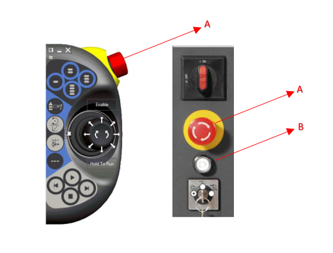

**A:** Acil Buton 

**B:** Motor On Buton

## 2. Çalışma Modları

- **A - Otomatik Mod :** Üretim Modu
- **B - Manuel Mod :** Jog modda hareket ve kontroller yapılabilir.

## 3. Jog Hareket ile Robot Eksen Kontrol 

- Robot manuel moddayken, hareket birimlerini devreye almak için FlexPendant'ın sağ tarafında bulunan 'Motor On' (Motorları Aktif Etme) butonuna basılmalıdır.

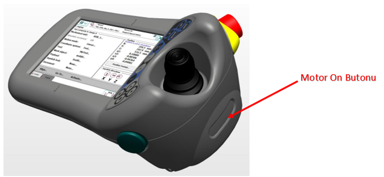

**A:** Motor On Buton

- Sol Üst menü çubuğundan Joging sayfasına girip eksenler ile ilgili durumları görebilirsiniz.
- Robotta 1-6 arası eksenleri tek tek hareket ettirebiliriz. İlk basımda 1-3 arası ikinci basışta 4-6 arası eksen kontrollerinin yönlerini ilgili eksen numarasının altında görebilirsiniz.

**A:** 1-6 arası eksen kontrol seçimi

**B:** Anlık seçili olan eksen aralığı

- Robot, lineer olarak X, Y ve Z eksenlerinde hareket ettirilebilir. Bu hareketler, arayüzde seçilen İş Nesnesi (Wobj) referans alınarak gerçekleştirilir ve hareket yönü, ilgili Wobj'nin yönelimine göre tayin edilir.

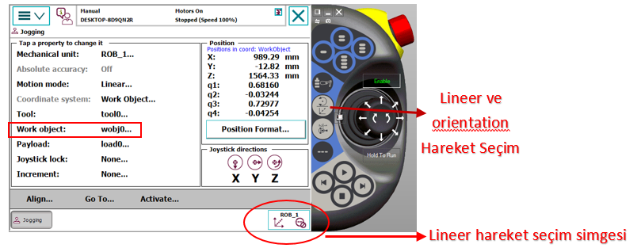

**A:** Lineer ve Orientation Hareket Seçim Butonu

**B:** Lineer Hareketin Gösterim Simgesi

- Tool seçimine göre orientation hareket. 

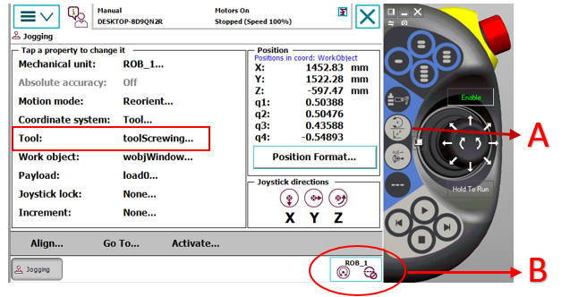

**A:** Lineer ve Orientation Hareket Seçim Butonu

**B:** Orientation Hareketin Gösterim Simgesi

## 4. Robot Eksen Kalibrasyonu 

- Robotun ilk kurulumu esnasında, her eksen için ayrı ayrı kalibrasyon işlemi gerçekleştirilmelidir. Kalibrasyon sırasında, her eksene ait sıfır noktası işaretleri (çentikler) birbirini tam karşılayacak şekilde, yüksek hassasiyetle hizalanmalıdır. Her eksenin kendine ait çentiği bulunmaktadır.

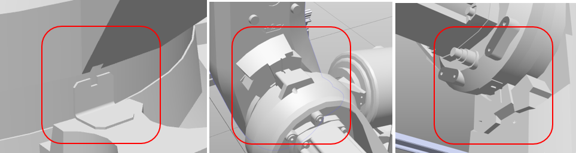

- Robot üzerindeki tüm eksenler fiziksel olarak kalibrasyon çentikleriyle hizalandıktan sonra, ilgili değerleri FlexPendant üzerinden kaydetmek için aşağıdaki görsel adımlarını takip edebilirsiniz. Bu işlem, robotun ilk kurulumunda veya sistemden 'Robot kalibrasyonu kayboldu' uyarısı alındığında uygulanmalıdır.

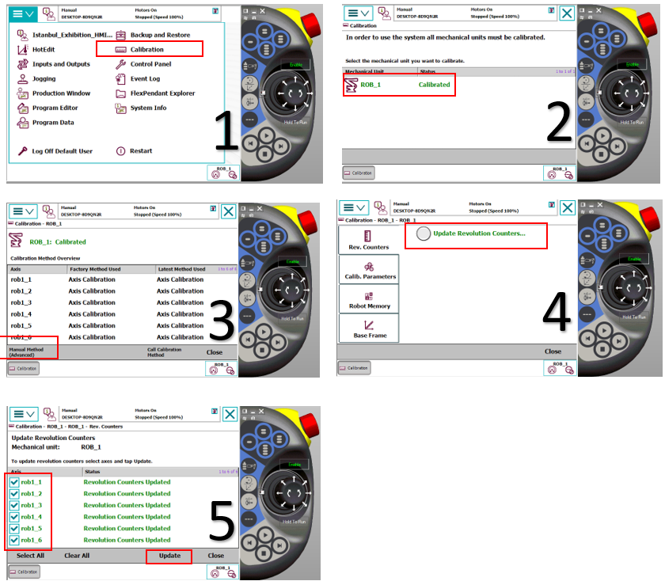

## 5. TCP (Tool Center Point) Tanıtımı 

TCP (Takım Merkez Noktası) tanımlama işlemi; sabit, ucu sivri bir referans noktasına farklı açılardan yaklaşım yapılarak gerçekleştirilir. Hem merkez noktasının hem de Z ekseni yönünün doğru tanımlanması için aşağıdaki adımlar takip edilmelidir:

- TCP&Z İçin Yaklaşım Metodu

Bu işlemde, yüksek hassasiyet sağlamak amacıyla toplam 5 adet yaklaşım noktası tanımlanmalıdır:

Yaklaşım 1, 2 ve 3 (TCP Belirleme): Referans noktasına, aralarında yaklaşık 120° açı bulunacak şekilde üç farklı yönden temas edilir.

Yaklaşım 4 (Dik Bakış): Takım, referans noktasına tam dik (90°) konumdayken temas ettirilir. Bu, yönelim hesaplaması için temel referans noktasıdır.

Yaklaşım 5 (Z Yönü Tanımlama): Takım, referans noktasından Z ekseni doğrultusunda yukarı kaldırılarak tanıtılır. Bu son nokta, robotun takım koordinat sistemindeki pozitif Z yönünü doğru algılamasını sağlar.

- Kritik Uygulama Notları

Hassasiyet: Tüm yaklaşımlar, sabit referans noktasının tepe kısmına (uç noktasına) aynı milimetrik hassasiyetle temas etmelidir. Temas noktalarındaki sapmalar, robotun çalışma hassasiyetini doğrudan düşürür.

Doğrulama: Tanımlama bittikten sonra robot manuel modda (Orientation) hareket ettirilerek, takım ucunun referans noktasında sabit kalıp kalmadığı kontrol edilmelidir.

- Yaklaşım Görselleri

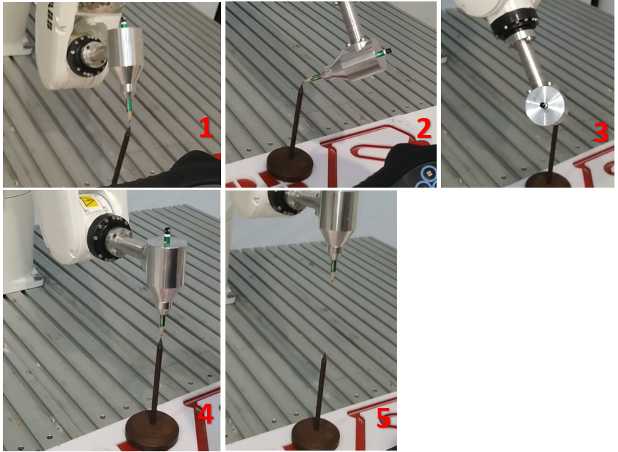

- Tool Tanıtma Kalibrasyon Adımları

Yukarıdaki görsel sıralamasını takip ederek her referans noktasına hassas yaklaşım sağlayın. Her bir noktaya erişim tamamlandığında, aşağıdaki görselin 5. adımında belirtilen 'Modify Position' butonuna basarak ilgili koordinatı sisteme kaydedin. Tanımlanması gereken tüm noktalar bu şekilde öğretildikten sonra, 'OK' butonuna basarak kalibrasyon sürecini sonlandırın.

**NOT:** Bu işlem için Robot Manuel Mod da olmalıdır.

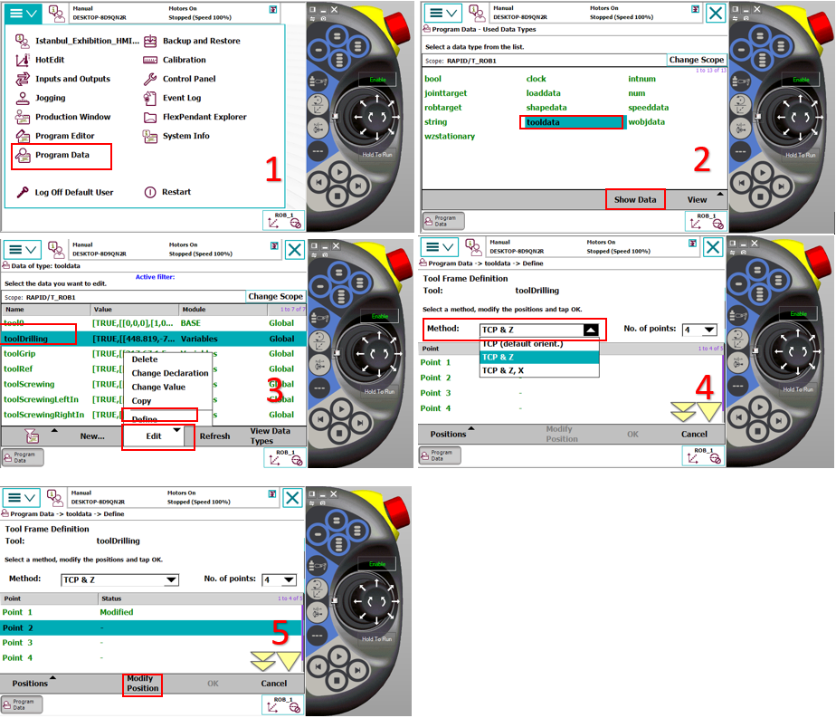

## 6. Wobj (Work Object) Tanıtma 

**Wobj (Work Object) :** robotun çalışma alanındaki parçaları veya düzenekleri tanımlamak için kullanılan, kullanıcı tarafından belirlenmiş bir koordinat sistemidir. ABB robot sistemlerinde Wobj tanımlama işlemi, ilgili yüzey üzerinde 3-Nokta Metodu kullanılarak gerçekleştirilir.

- 3-Nokta Metodu ile Tanımlama
Koordinat sistemini oluşturmak için operatör tarafından sırasıyla şu üç referans noktası öğretilir:

X1 (Orijin Noktası): Tanımlanacak olan yüzeyin başlangıç (sıfır) noktasıdır. Koordinat sisteminin merkezi bu nokta olarak kabul edilir.

X2 (X Ekseni Yönü): X ekseninin doğrultusunu belirleyen ikinci noktadır. X1 ile X2 arasındaki hat, sistemin pozitif X yönünü oluşturur.

Y1 (Y Ekseni Yönü): Y ekseninin doğrultusunu belirleyen üçüncü noktadır. Bu nokta, X eksenine dik olan pozitif Y yönünü tarif eder.

Robotu herbir tanıtma noktasına  (X1,X2,Y1) ayrı ayrı götürerek üzerine 5 numaralı görselde ki şekilde Modify Position diyerek o noktanın koordinatlarını öğretebilirsiniz. Tüm öğretmeler tamamlandıktan sonra 5 numaralı görseldeki gibi Ok diyerek işlemi tamamlayabiliriz.

Otomatik Z Ekseni ve Düzlemsellik

Öğretilen bu üç noktanın oluşturduğu düzlem, sistem tarafından matematiksel olarak hesaplanarak Z eksenini otomatik olarak tayin eder.

Eğimli Yüzeylerde Hareket: Tanımlanan yüzey eğimli olsa dahi, robot bu yüzeye ait Wobj referansıyla hareket ettiğinde, yüzeyin eğimini baz alarak kusursuz bir lineer (doğrusal) hareket sergiler.

Hassasiyet: X ve Y noktaları arasındaki mesafe ne kadar uzak ve noktalar ne kadar hassas seçilirse, oluşturulan Wobj'nin doğruluğu o derece yüksek olur.

**NOT-1 :** Wobj tanımlama işlemi sırasında kullanılan Tool'un (Takım) TCP değerlerinin doğruluğu, oluşturulan iş nesnesinin hassasiyetini doğrudan etkilemektedir.

**NOT-2:** Bu işlem için Robot Manuel Mod da olmalıdır.

- Wobj tanıtım işleminin nasıl yapılacağını aşağıdaki görsellerden takip edebilirsiniz.

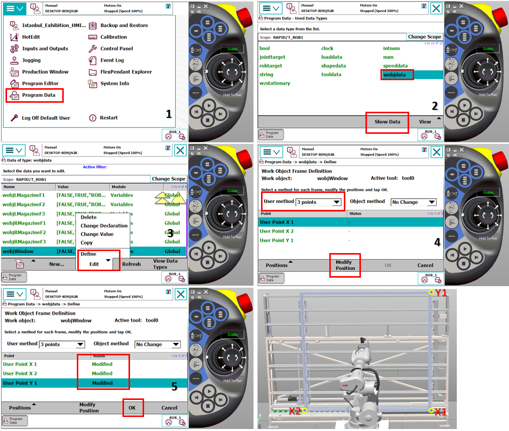

## 7. Kalıp Alma ve Bırakma Noktalarının Öğretilmesi 

Sistemde kalıp alma ve bırakma işlemleri aynı koordinat düzlemi üzerinde gerçekleştirilmektedir. Bu nedenle, alma noktası için yapılan tanımlama otomatik olarak bırakma işlemi için de geçerli olacaktır.

- Magazin Yerleşimi ve Yazılımsal Yapı:

Mevcut sistemde, her biri 3 kattan oluşan Sol ve Sağ Magazin yerleşimleri bulunmaktadır. Bu yerleşimler sistem içerisinde F1, F2 ve F3 olarak kategorize edilmiş olup, her bir katın hücre düzeni yazılımsal olarak Array (Dizi) yapıları ile tanımlanmıştır. Bu dizi yapısı, robotun her bir kat içindeki alt bölmelere otomatik ve hassas bir şekilde yönlenmesini sağlar.

**ÖNEMLİ NOT:** Tüm nokta tanımlama ve güncelleme işlemleri, robotun standart çalışma çevrimindeki yönelim değerleri korunarak gerçekleştirilmelidir. Rastgele seçilmiş eklem açıları veya yönelimlerle nokta güncellemesi yapılmamalı, robotun hedef noktaya olması gereken yaklaşım açısında bulunduğu teyit edilmelidir.Rastgele pozisyonlarda yapılan kayıtlar, otomatik modda yörünge hatalarına ve mekanik çarpışmalara sebebiyet verebilir.

- Kalıp alma noktasının tanıtımları yapılırken şu adımlar izlenmelidir:

**Hizalama:** Robot, ilgili alma noktasına manuel modda hassasiyetle konumlandırılmalıdır.

**Mekanik Kontrol:** Gripper açık pozisyondayken, merkezleme pimlerinin kalıp üzerindeki yuvalara tam olarak hizalandığı teyit edilmelidir.

**Kilitleme Testi:** Gripper kapatılarak mekanik uyum ve tutuş güvenliği kontrol edilmelidir.

**Kayıt:** Fiziksel yerleşimin sorunsuz olduğu doğrulandıktan sonra, aşağıda belirtilen görsel yönergeler takip edilerek ilgili Array (Dizi) elemanına ait referans noktasının kayıt işlemi tamamlanmalıdır.

**NOT:** Bu işlem için Robot Manuel Mod da olmalıdır.

  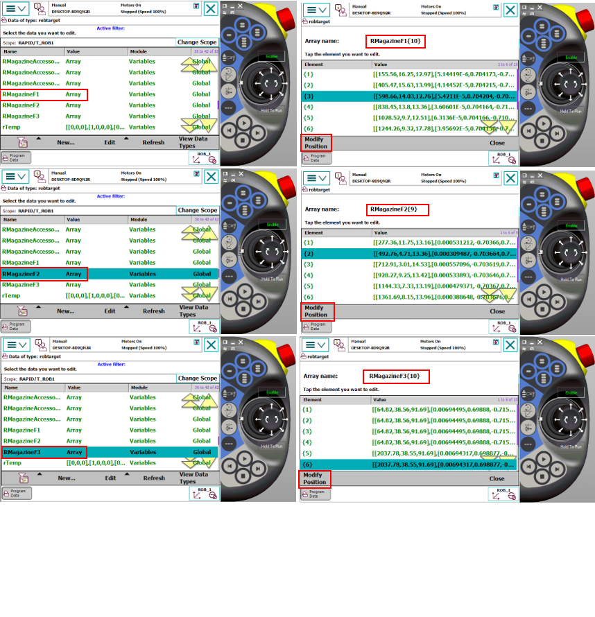

## 8. Aksesuar Kontrol Noktalarının Öğretilmesi 

Sistemde yer alan her bir aksesuarın varlık/yokluk kontrolü için kendine ait bir kontrol sensörü bulunmaktadır. Aksesuar kontrol noktasının doğru tanımlanması için şu prosedür izlenmelidir:

- Hizalama ve Konumlandırma:

Robot, ilgili istasyondan kalıbı aldıktan sonra, tutuş düzlemini ve oryantasyonunu bozmadan (doğrusal bir rotada) çıkış yapmalıdır. Aksesuar, sensörün tam karşısında ve algılama mesafesi dahilinde kalacak şekilde konumlandırılmalıdır. Robotun bu kontrol noktasındaki pozisyonu, sensörün aksesuarı en kararlı şekilde gördüğü konum olarak belirlenmeli ve kaydedilmelidir.

- Yazılımsal Yapı:

Alma-bırakma noktalarında olduğu gibi, aksesuar kontrol noktaları da her aksesuar grubuna özel olarak isimlendirilmiş Array (Dizi) yapıları içerisinde tanımlanmıştır. Bu sayede her aksesuar tipi için ayrı ve bağımsız kontrol koordinatları oluşturulabilir.

- Kayıt İşlemi:
Hassas konumlandırma tamamlandıktan sonra, nokta kayıt adımları aşağıdaki görsel yönergeler takip edilerek gerçekleştirilmelidir.

**NOT:** Bu işlem için Robot Manuel Mod da olmalıdır.

  

## 9. Delme Tool Ucunun Kontrol Noktasının Öğretilmesi 

Robot, delme operasyonuna başlamadan önce matkap ucunun bütünlüğünü (kırık kontrolünü) DrillingToolControlProg rutini aracılığıyla denetler. Sistemin bu denetimi sağlıklı bir şekilde gerçekleştirebilmesi için referans kontrol noktasının doğru öğretilmesi kritik bir öneme sahiptir.

- Dikkat Edilmesi Gereken Hususlar:

Tıpkı alma ve bırakma işlemlerinde olduğu gibi, kontrol noktasının da robotun kendi işleyiş çevrimine uygun aynı yönelimde öğretilmesi zorunludur.Robotun bu noktaya standart çalışma açısıyla gelmesi, hem algılama hassasiyetini artırır hem de yörünge hatalarını engeller.

Söz konusu noktanın tanımlanması ve kayıt adımları, aşağıdaki görsellerle detaylandırılmıştır.

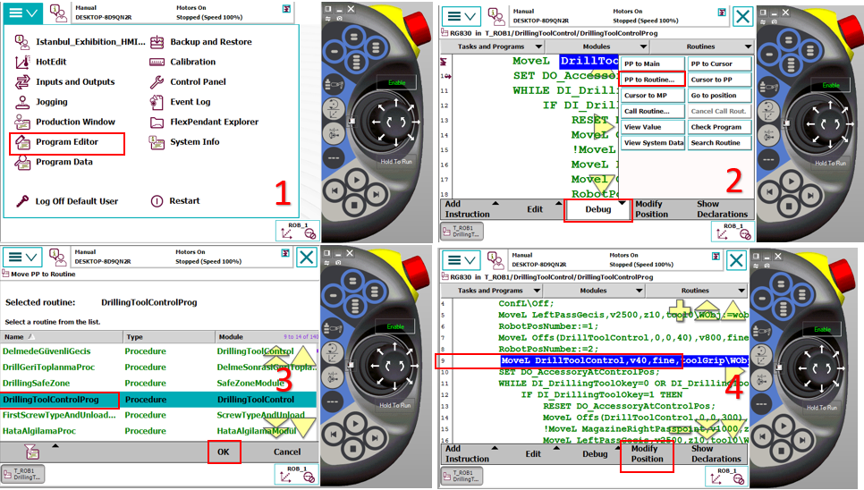
