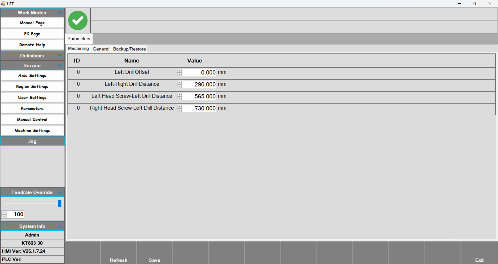

# RG830 Robot Manual

İki motor, iki vidalama, revolver ve X ekseni, profil üzerine menteşe montajı kasa makinası

## Region and Language

**Region and Language :** İstenilen dil veya ölçü birimi seçildikten sonra Save butonuna basılır ve yapılan değişiklikler kaydedilmiş olur.

## Manual Control

**Manual Control :** Activate butonuna basıldıktan sonra istenilen çıkışa basarak aktif edilir. Tekrar basarak eski konumuna getirilir.

## Parameters

- **Parameters:** Bu sayfada tool grubunda bulun motor ve vidalama gruplarına ait ofsett değerleri bulunmaktadır.
- **Left Drill Offset:** Tool grubunun ilk motorudur. En solda olduğu için bu motor sıfır olarak alınır.
- **Left-Rigt Drill Distance :** İki motor arasındaki mesafedir.
- **Left-Head Screw – Left Drill Distance :** İlk motor ve ilk vidalama grubu arasındaki mesafedir.
- **Right Head Screw-Left Drill Distance :** İlk motor ve ikinci vidalama grubu arasındaki mesafedir. 
